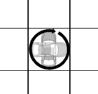
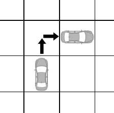
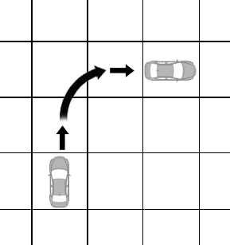
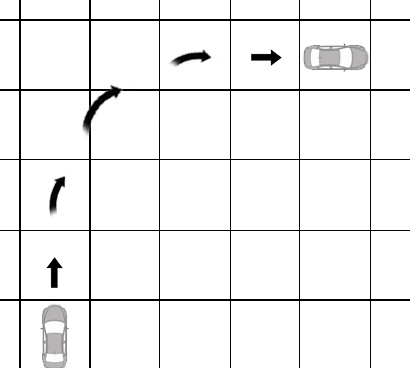

# 名词解释和常见问题

## 写在最前：自然语义

书里的绝大多数文本都是以【自然语义】进行叙述的。

通常来说，如果你对一个说法有疑虑，只要联系上下文，就足以得到一个正确的理解结果；如果你还是觉得没法判断，那么问问其他人。再次提醒，团内最终总是以ST的裁定为准。

另外提供一个简单的判断方式：如果你发现一个说法有AB两种解释，其中有A是对你极其有利的，而B则很普通，那解释A通常就是错的（笑）。

此外，这也不是某CCG游戏，“以下”的意思就是以下，不是自身及以下；“低于”的意思就是低于，不是等于或低于。

不过，审核组总是乐意去做一些易混淆的说法修正。如果你觉得一个内容十分容易误解，请加入麻将群并向审核组反馈（群号在0.前述 章节中）。

## 机动性

任何移动方式皆具有一定的机动性。机动性分为五档，由高到低分别为：完美→良好→普通→笨拙→无。

**完美**
可以任意角度转弯，可以随时前进或后退。对于飞行或游泳来说，还可以进行直线上升或下降。

在人物以正常方式移动时，机动性一般都是完美。

**良好**
转弯半径等于或低于自己的体积/2米（映射到地图上，即转弯前后都需要移动相当于自己占地格的距离）；由前进改为后退时需消耗一半移动力。对于飞行或游泳来说，直线上升时，移动速度减半计算。

摩托车、自行车，以及性能良好的小型车和四驱赛车在慢速行驶时的机动性都是良好。

**普通**
转弯半径等于或低于自己的体积米（映射到地图上，即转弯前后都需要移动相当于自己2倍占地格的距离）；无法直接由前进改为后退。对于飞行或游泳来说，无法直线上升，爬升时的最大仰角为60°。此外，如果是正在飞行的单位，每轮至少要移动相当于移动速度一半的距离，否则就会开始坠落。

大部分以正常速度行驶时的陆地载具的机动性都是普通。

**笨拙**
转弯半径为等于或低于自己的体积×2米（映射到地图上，即转弯前后都需要移动相当于自己4倍占地格的距离）；无法直接由前进改为后退。对于飞行或游泳来说，无法直线上升（除非它只能直线上升，比如火箭），爬升时的最大仰角为45°。此外，如果是正在飞行的单位，每轮至少要移动相当于移动速度一半的距离，否则就会开始坠落。

以正常速度行驶的快艇，慢速行驶小型舰船的机动性为笨拙。

*在某些资源中，机动性“笨拙”也被称为“不良”，它们是同一个东西。

**无**
转弯半径为自己的体积×2米以上（映射到地图上，即转弯前后都需要至少移动**至少**相当于自己4倍占地格的距离）；无法直接由前进改为后退。对于飞行或游泳来说，无法直线上升（除非它只能直线上升，比如火箭），爬升时的最大仰角为45°。此外，如果是正在飞行的单位，每轮至少要移动相当于移动速度一半的距离，否则就会开始坠落。

已加速到其巡航速度行驶的客机、大型舰船、升空的火箭、（通常来说）正在冲锋的单位的机动性为笨拙。

注：机动性的计算较为繁杂，而且常见的机动性计算多应用于载具驾驶等情况。一般情况下，ST只需要注意机动性**无法**做到什么即可――例如，机动性良好以下的飞行能力无法直升；机动性完美以下的移动能力在拐弯时需要一段距离；诸如此类。

==================================

## 同时使用的能力

身法：轻功，七夜体术等都属于这一类。属于控制身体运动的方式。

护身劲：通过能量保护身体的方式。

招式：各种使用类的中外武学大多属于这一类。一般而言，我们将“使用非自由动作以进行某种行为”称为使用了招式。

心法：心法一般属于被动技能，也可能是其他技艺的前置。

叠加：只要动作消耗不冲突，玩家可以使用任意数量的技艺。一般判定不可同时使用的判定标准为【消耗某个动作发动的能力】；例如，如果你要花费一个标准动作进行一次【全力攻击】，那么你无法同时发动八极拳的【寸劲】（因为它们都要花费一个标准动作）；不管该技艺属于招式、身法、护身劲还是心法，只要他们消耗不同的动作就可共用，例如玩家可以在平时消耗移动动作使用体感格斗术为自己提供防御上的闪避加值，并在遭受攻击时使用反射动作以九曜极速转换伤害。

**普通攻击**
普通攻击一般指的是“不附带招式的普通攻击”。也就是未指定消耗动作（当然，一般而言，攻击还是需要一个标准动作）即可进行的攻击。

例如，“以一个标准动作进行一次白刃攻击”即为使用了招式的白刃攻击，并非普通攻击；“以人造武器进行一次近战攻击”即为未附带招式的白刃攻击，也就是普通白刃攻击。

其他手段的普通攻击概念以此类推。例如普通肉搏攻击、普通施法攻击，等等。

==================================

## 留手

留手是指，当你进行一次检定后，你可以选择获得比实际成功数要少的成功。例如，约翰对亨利用剑进行一次攻击检定。他的这次攻击检定获得了共计7个成功。他可以选择只造成3点伤害，而不是正常的7点。

一般来说，大部分攻击都可以选择留手，这可能意味着，玩家用了更少的力道进行攻击，或者使用枪械射击非致命部位，等等。

但有些情况下，留手较为困难。这包括：

-若没有特殊强化支持，你无法在使用枪械进行长点射和连射中留手。

-如果你无法精确定位一个角色，你无法在对其的攻击中进行留手。

-如果两个角色处于同一格子、擒抱、附身等状态，令你无法准确攻击到该角色，你无法在对其的攻击中进行留手。

-若没有特殊强化支持，你无法在同时攻击多个对象的攻击中，对某几个对象单独留手（但你仍可选择对本次攻击中所有的对象同时进行留手）。

==================================

## 多目标攻击和区分敌我

多目标攻击是指在一次行动中，同时对多个目标造成影响的行动。无论是手雷爆炸、机枪扫射，抑或召唤毒云、射出贯穿性的激光、一弓四箭分射不同的四人，都属于“多目标攻击”。

**在多目标攻击中区分敌我**
有些多目标攻击是会区分敌我的，这些能力一般写为“对范围内的【敌人】进行攻击/造成伤害”，或者“【选择】范围内N个目标进行攻击/造成伤害”。

另外一些多目标攻击则不会区分敌我，这些能力一般写为“对范围内的【角色/单位/目标】进行攻击/造成伤害”，或者“对范围内造成伤害”

即使一个多目标攻击的能力是可以区分敌我的，你也只能对可以精确定位、且可以准确攻击到的角色进行敌我区分。

例1：玩家姜世强化了一个“对1000米范围内所有敌人进行攻击”的能力，但他的敏感范围仅有140米，且还有一名强化不可视狼人的自闭队友艾利斯隐匿在侧。他可以令敏感范围内的友方角色不受这次攻击的影响，而未侦查到的艾利斯与敏感范围外的角色则都被他纳入了攻击对象中。

例2：玩家啤酒与四个鳄鱼人正在团团擒抱中，此时，玩家慕容使用“选择5米范围内最多10个单位进行一次攻击”的远程攻击能力，因为他不想承受“攻击擒抱中的角色”的减值，所以无法区分啤酒和鳄鱼人，他只好选择攻击这所有的5个单位。

**多目标攻击的叠加**
同时生效的复数个多目标攻击的效果，若没有特殊说明，则彼此不会叠加，由施放者选择受到影响的角色受到哪个效果影响。

例1：有两个能力――能力1：标准动作使用，进行一次攻击，这次攻击可最多射出5根箭，分别攻击5名目标；能力2：射出的箭将造成爆炸，攻击改为造成一次22L的范围伤害，范围为半径5米的圆形范围。这两个能力组合后，最多造成5个范围为半径5米的圆形范围的范围伤害，即使其中有两个被攻击目标之间的距离不超过2米，这两个目标依旧只承受一次范围伤害，而不是两次。

例2：玩家鱼骨强化了“同时攻击10米范围内所有角色”，和“攻击角色时，同时以-5DP攻击距离不超过其2米的两个角色”两个能力。而在鱼骨的正前方，有直线排列的4个敌人，分别距离他8、9、10、11米。鱼骨使用上述两个能力攻击时，前三个敌人只会受到一次攻击，当然，鱼骨选择第一个无需扣减DP的能力生效；第四个敌人也只会受到1次攻击，此时，鱼骨只能选择使第二个能力生效。

**能力目标的定义**
在能力中，有大量有关友方、敌方等等用语。对于这些用语的规范如下：

友方/友军：除能力的使用者以外，将使用者认知为友善，同时也被使用者认知为友善的单位。

敌方/敌军/敌人：除能力的使用者以外，使用者认知为敌对的单位。

我方/我军：与“友方/友军”一致，但是包含能力的使用者。

对手/单位：通常来说，指的是由玩家选择的任何目标。

特殊的，ST有权判断一些能力的目标是“不合理的”。举例而言，某玩家封平随身携带了一窝蚂蚁，在战斗中使用根据造成的伤害而恢复能量的AOE能力对蚂蚁同时进行攻击，以恢复自己的能量。

**使用者和友方**
Q：“友方”包括我自己吗？视线内包括我自己吗？

A：如上所述，若“友方”未专门说明，一般不包括能力的使用者。视线一般是对于施法者来说的，它的视线内包括施法者自己。

Q：“以使用者为中心的范围”包不包括我自己？

A：跟范围无关，与能力目标的定义有关。例如，“以使用者为中心，半径20米范围内的友方单位”，就是不包含使用者自己的；“以使用者为中心，半径20米范围内的我方单位”就包含使用者自己。

==================================

## 减少防御和接触攻击

Q：接触攻击、减少防御分别都是什么？

A：接触攻击无视盔甲和天生的防御。减少防御则是通过高速、破甲、威猛等减少对方的防御。无论如何，防御不能被减到0以下。

如果因为破甲值将盔甲防御减到0，那么代表着你这次攻击是无视盔甲的――这会让盔甲的其他特性也暂时失效，例如防弹、防能量、盔甲附带的DR和全伤害吸收等。也即是说，接触攻击不会让攻击对象失去盔甲或者天生防御带来的特性。

==================================

## 持续buff

一般来说，持续时间不超过10分钟的能力――哪怕是主动能力，都会视为在切换场景后消失。一般来说，此限制也包括了你无法宣言你的人物随时随地处于格挡或者全力防御状态，因此可以在一次突袭中保持格挡或全力防御的好处。

当然，若PC们早已预知到了一次袭击，或者能力能立刻被使用，或者表现出了极端的被迫害妄想症（绝对独自行动，见到任何人都会毫不犹豫地发动先制攻击，认为路上布满了陷阱）的情况下，不停地给自己刷buff或者保持格挡全防都可以认为是合适的扮演行为。

==================================

## 效果线

直线型效果线：最通常的效果线。开枪射击、魔法射线、乃至于挥刀横砍等，都是直线型效果线。

直线转弯型效果线：通常需要在描述里带有无视一定数量的掩蔽加值的效果。根据描述，ST可以酌情判断其可以攻击到掩体后的角色（例如，绕过一棵树攻击树后的角色）。

抛物线型效果线：攻击需要一定高度。若无描述，ST可简单判断所需高度=攻击目标距离的一半。根据描述，ST可以酌情判断其可以攻击到一定高度的角色（例如，在悬崖下通过抛物线攻击到悬崖上无法直接看到的敌人），相对应的，这一类攻击方式也需要承担可能在某些地形中无法使用的缺点。

上下型效果线：通常来说，它们都有对应的发动要求：例如，正上方没有遮挡（如落雷）；从沙土地升起最高20米的地刺（如地刺）。根据描述，ST可以酌情判断其可以攻击到掩体后的角色，相对应的，这一类攻击方式也需要承担可能在某些地形中无法使用的缺点。

传送攻击类效果线：如果一个攻击具有【传送攻击】词条，那么它通常需要在描述里叙述其传送效果的等级和来源。通常来说，传送攻击可以直接在射程上的任意一点为起点出现，因此它总是可以无视全掩蔽效果（但是玩家可能仍然需要先定位自己的攻击目标）。需要注意的是，一个“不需要效果线只需要视觉线”的攻击也同样属于传送攻击类效果线；一个“从最近的固体生成地刺”也属于传送攻击类效果线的一种。它们都会在资源中说明自己的传送效果的等级和来源。

若一项攻击方式的效果线并未在资源中说明，ST可以结合资源描述和现实情况进行判断。通常来说，如果你没有特殊的攻击方式，你的效果线总是直线型的。

例如，如果一个角色强化了战斗专长中的2级：弧形射击（描述为“你将箭往高处射，利用抛物线的原理杀伤敌人”），那么，他可以使用抛物线攻击，并得到此专长的好处，并以抛物线型效果线来判断他的攻击；如果他改为了直线射击，他会失去此专长的好处。当他没有这个“提供抛射攻击方式”的专长或者类似强化时，ST可以判断他无法进行抛射，或者试图抛射需要承受DP减半的负面效果。

==================================

## 检定的替换

在资源中，存在一系列“代替检定”。例如，“以敏捷代替力量进行近战攻击”，就是一个很典型的替换鉴定。此外，也有一些其他写法，例如“以施法骰进行侦查鉴定”等等。

但是，需要注意的是，代替检定总是只改变检定的属性、技能和专业的【组成】，而不会改变检定的【类型】。

例如，“你可以以反射代替强韧进行豁免”，实际上是一个缩写，其展开含义为“在进行强韧豁免时，你可以以反射检定的属性、技能、专业（通常来说是敏捷+运动：反射），代替强韧检定的属性、技能、专业（通常来说是耐力+生存：强韧）来进行检定”。

因此，这个鉴定仍然是强韧豁免，诸如“强韧豁免+2DP”的能力可以在代替鉴定后继续生效，但“反射豁免+2DP”则不行。此外，由于检定的构成发生了变化，因此该强韧豁免无法享受“耐力检定+2DP”的加成，但能享受“敏捷检定+2DP”的加成。

与之类似的，还有“以施法骰进行一次近战白刃攻击”――因为检定的【类型】不会发生改变，本质上只是替换了属性、技能、专业的【组成】，因此在这次检定中无法加入法强，或者一个“施法骰+2DP”的效果。

==================================

## “被传送进了石头里”

**传送能力的使用**
如果没有特殊说明，所有传送能力都是直接作用于空间的能力――你从原地消失，又在另一个点出现。因此，传送能力无需效果线，它可以跨越通常的障碍，并且无视困难地形的影响。如果传送能力的启用无需动作，你可以在定身状态下启用这个能力来进行移动（但是，你仍然有可能因为定身状态降低移动速度的效果导致无法移动）。

但是，如果没有特殊说明，所有的传送能力都需要你正在以某种方式观察着目标点……或者说，你必须可以精确定位你的传送目标点，才能进行传送。当然，亦存在某些高等级的传送能力不需要定位传送点，只需要目的地坐标就能传送的情况，它们会在强化中单独说明。

**意外情况**

在冒险中，你们可能碰到一些意外情况：传送能力搞错了坐标点，将你传送进了一块石头或者满是酸液的水中；你将自己临时转变为灵体穿梭在土壤中，但一道反魔法波动解除了你的灵体状态；土行孙在土里的时候遇到了指地成钢……总之，当你周围的环境在极短的时间里发生了剧烈的变化，且造成这个变化的强化未特殊说明如何处理其中的人物时，遵照以下规则处理：

首先，如果在环境变化后，人物身处于液体或气体中，无需进行特殊处理――因为通常来说，人物的密度要高于这两者。此时，人物会显而易见地位于原位，只需要在能力生效的回合结束时，处理因环境带来的其他效果即可。

如果在环境变化后，人物身处于固体中，则比较人物的硬度和所处新环境的硬度。通常来说，人物的硬度会被视为0（如果有些增加肉体硬度的强化，ST可以酌情判断）。

1、如果环境硬度高于人物硬度（通常来说，沙土的硬度是0，木头的硬度是1，石头的硬度是2），那么人物将会在回合结束时被弹出到最近的、硬度不高于人物硬度的区域环境。因此移动的每1米，都会让人物受到1点不可吸收减免的物理无类型冲击伤害。

特殊的，如果人物使用传送能力，进入了禁止被作为传送落点的区域时，如果没有特殊说明，那么也参照此情况进行计算。此时，人物将会立刻（请注意，仅对于传送能力而言，不是回合结束才会结算）被弹出到最近的、允许作为传送落点的区域，但是受到的伤害会减少人物的传送能力等级*5（D5C10~S25）点。

2、如果环境硬度不高于人物硬度，那么人物会停留在原地，并且在回合结束时在环境中“挤”出一个与人物的体积相等、仅够人物自己容身的小空间。因此被挤出的空间每有1点体积，都会让人物受到1点不可吸收减免的物理无类型冲击伤害。

需要注意的是，上文中环境变化产生的效应大多是在每个回合结束时结算的。在此之前，你仍可以尝试启动一些能力，如果该能力允许你在新的环境活动，你就无需在回合结束时继续结算环境变化的效果。但是，你的移动行为本身仍然可能被环境变化打断（如果这个环境变化是发生在你的移动过程中的）。

例1：玩家QF的回合，将玩家司空脚下一片范围的土地变为了水坑。在回合结束时，结算环境变化产生的影响――司空落入水坑当中；接着是司空的回合，他先消耗一个移动动作试图以C级传送能力传送2米回到地面，但此时，QF以反射动作封禁了范围10米内的传送落点，持续到他的下个回合开始；司空的传送能力失败，他被从落点弹射了5米，重新落回水中，但他并未受到伤害。

例2：玩家QF正准备在水中游泳移动时，玩家司空以反射动作响应QF的移动动作，使用能力冻结了QF周围5米的水。QF的移动动作被打断，并且由于冰的硬度（1）高于他肉体的硬度（0），他在本回合结束时就会被弹出到最近的、没有冰的区域；QF立刻选择使用一个标准动作，将自己转变为虚体，此时，因为他可以在新的环境中移动，他无需在回合结束时再被弹出。

*如果有规则中未叙述到的其他情况，交由ST判断。

==================================

## 死亡与复活

**死亡**
没有特殊能力的情况下，当人物所有生命值都变为A时，人物便会死亡；有些能力无需使生命值都变为A，就可以让人死亡，如“即死”、耐力变为0等。

在判断中，已经死亡的玩家的角色卡暂时从游戏中离场，任何需要玩家主动进行或施展，或者以玩家的主观角度来选择目标、敌友等的能力都无法继续生效。玩家在死亡时正在进行的动作会被打断并立刻失去进行任何动作的能力（因此，玩家无法宣称“我要在死亡时以一个反射动作将3点生命变为完好，这样我就可以规避这次死亡”），但他对别人或场地施加的持续效果（如异常点数、加持在队友身上的法师护甲等）会继续生效。如果一个能力需要与施展者对抗，那么仍然以这个玩家在死亡时的数据进行对抗。

**“已经死亡的角色”**
通常来说，能力是无法以“已经死亡的角色”作为目标的。例如，角色不能宣称自己进行一个准备动作，攻击正在释放奎托斯的死亡复仇的玩家，并令他在释放的过程中“再死一次”以打断效果，因为攻击无法以“已经死亡的角色”作为目标（当然，如果你的能力是“以正在释放中的能力为目标，打断此能力”，那么它仍然生效）。

但特殊的，可以对他人施展的复活、或者禁止复活能力，可能会以“已经死亡的角色”作为目标。当目标为“已经死亡的角色”时，按照以下优先级进行选取：该角色的“生与死的中间态”→该角色大致完整、且处于本位面的尸体→该角色死亡时的位置。也就是说，如果你释放能力的时候，该单位已经以另一个形态――如虚体或灵体存在，则需要选中那个虚体或灵体目标；如果没有此形态，则你可以选择该单位的尸体；如果该单位的尸体已经不存在，则你可以选择该单位在死亡时的位置。显然，如果你选错了目标点，该效果就不会生效。

例1：玩家司空在死亡后，阳神出窍逃离了战场，原地仅留一具尸体；队友对尸体施展了目标为“范围内所有已经死亡的角色”的复活术，复活失败了。

例2：玩家司空在死亡后，没有复活手段，其队友带着尸体离开了战场；他们的敌人为了防止司空复活，对司空死亡的区域施展了“腐蚀大地”（选择一片区域，在这片区域中已经死亡的单位无法被S级以下的效果复活）。但是此时，司空的尸体已经不在这个区域，因此没有承受此效果。

例3：玩家司空在死亡后，没有复活手段，其队友将他的尸体装入空间袋，离开了战场；他们的敌人为了防止司空复活，对司空死亡的区域施展了“腐蚀大地”（选择一片区域，在这片区域中已经死亡的单位无法被S级以下的效果复活）。此时，司空不存在生与死的中间态，他的尸体不在此位面，因此效果生效。后续他的队友对司空喂食了“还魂丹”（S级复活），会发现司空并未被复活成功。

**复活**
若没有特殊说明，所有非永久的BUFF，DEBUFF等，复活时都会直接移除；人物的生命值、意志值和所有能量都会回复到满值。

所有永久获得的效果，如永久增加属性，永久降低血上限，永久只能使用一次的能力被使用了，则复活时该效果依然生效。

在死亡后，人物先触发除了复活以外的、“在死亡时触发”的能力（例如斯巴达A级-奎托斯的死亡复仇），接着触发复活效果；如果人物身上有多个复活效果，则由人物选择触发哪个。只要角色选择了触发，该能力的使用次数（如果有）就会被立刻消耗。

特殊的，当一个角色已经处于某能力的复活流程中时，他不会承受等于或低于该能力等级的另一复活效果。例如：玩家司空在死亡后阳神出窍，需要等待4周复活（A级复活）；此时，他的敌人对他施展了“死者操控”（A级，立刻复活并支配），因为等级都是A级，所以“死者操控”的效果无效；接着，他的队友为他喂下还魂丹（S级复活，7天后复活），因为等级高于正在进行的复活流程，因此在七天后，还魂丹生效，司空立刻从阳神状态下复活。

**生与死的中间态**
在一些复活相关的能力中，会在角色死亡之后，令角色进入一种新的形态继续存在。

在进入此状态时，若强化中没有特殊说明，则你的生命值会恢复到满值；你承受的其他效果，无论是BUFF还是DEBUFF都会在新的形态下继续生效。但是，有些效果可能因为状态的转化而失效（例如：玩家吕布被网兜罩住，在【定身】的状态下被杀死后，触发复活能力变为灵体状态的阳神，灵体因为无视物理影响，所以不再继续承受网兜的【定身】效果），具体由ST判定。

大部分时候，这个形态被用于正式复活前的等待（如蓬莱药、龙虎游云）；但无论如何，转化为中间态也被视为复活流程的一部分，因此，禁止复活的能力会同样禁止该复活能力所带来的状态转化（例如：玩家妹红在“无法被A级或更低的复活能力复活”的效果影响下死亡，她无法启动身上的蓬莱药改造来令自己转化为虚体）。

在此状态下再次死亡，通常意味着角色的本次复活流程被打断，角色重新进入死亡状态。它们可能会被描述为“在此状态下死亡你会彻底死亡”――别担心，你还是可以启动其他的复活能力（除非另有说明）。

**禁止复活**
禁止复活的能力通常会在角色死亡时生效，也有一些能力是对于已经死亡的角色施展的。

无论如何，禁止复活可以视为一个持续到下次被成功复活的DEBUFF，会被一次成功的复活清除。

==================================

## 将某种防御减少为0

**基于防御的效果**
在游戏中，有一些基于某类型的防御的效果。当他们所基于的防御被某种原因减少为0时，这些效果也会同时失效。它们包括：

1、防御上的附加成功。

防御上的附加成功同样具有类型。例如，如果一个能力的效果是“获得1点防御上的附加成功，这是闪避加值”，那么，当角色的闪避防御值因为高速等原因被变为0时，这1点防御上的附加成功也会同时失效。同样的，如果一个角色一开始就没有闪避防御，那么这一点附加成功也处于失效状态。

2、伤害吸收和减免。

伤害吸收和减免（即伤害吸收、伤害减免、能量抗力等，详见3.2.2伤害一章），都会基于某种防御。通常来说，它们会在被获得时说明它们基于何种防御；如果没有说明的话，那么默认基于提供伤害吸收和减免的那个强化同时提供的一种防御。如果那个强化提供了多种防御，则从提供的防御类型中，按照以下顺序决定这些伤害吸收和减免基于哪种防御：

盔甲>天生>闪避>格挡>掩蔽>洞察>偏斜>力场>能量>士气>神圣/亵渎>幸运。

如果那个强化没有提供防御，则同样按照上面的顺序，令这些吸收减免基于你已经具有、且不为0的一种防御上。

无论是强化提供多种防御的情况，或者没有提供防御的情况，都需要你在购买这些具有吸收或减免能力的强化时，根据上面的顺序决定它们基于哪种防御，之后不能更改。

**例如，玩家鹤（基础防御2，盔甲防御2）强化了以下几项强化：“①你获得1点冻寒能量防御，和基于冻寒能量防御的2点冻寒能量伤害抗力”、“②佩戴后，你获得6点天生防御，和3点力场防御，以及3点DR/-”、“③只要你本回合进行了移动，你就获得5点全伤害吸收”。此时，由于第一个强化说明了伤害的吸收减免挂靠的防御类型，他获得了基于能量防御的冻寒伤害抗力；第二个强化提供了多种防御类型，同时没有说明吸收减免挂靠的防御类型，则根据上面的顺序，这3点DR/-默认挂靠在天生防御上；第三个强化没有提供防御，根据上面的顺序，那些全伤害吸收会基于他的盔甲防御。

3、其他会基于防御的效果。

这些效果包括：防弹、防能量、封闭。它们如未说明基于哪个防御，如上文中的伤害吸收和减免的判断步骤相同。

显然的，多个防弹/防能量/封闭特性的效果不会与自身叠加，即使它们基于不同的防御类型也一样；但是，如果你有多个基于不同防御类型的特性，你可以选择对你来说最好的那个生效。

**例如，玩家王家卫同时具有一个基于18盔甲防御的防弹，和一个基于16闪避防御的防弹。在某次战斗中，他受到了一次具有14破甲、8高速特性的枪械攻击，在结算之后，他的盔甲防御只剩下4点，闪避防御还剩8点，他可以选择使用基于闪避防御的防弹特性来获得更高的减伤；剩余基于4点盔甲防御的防弹特性就无法生效了。

**减少防御的方式**
在书中的效果，无论是“减少某防御”、“忽略某防御”、“无视某防御”、“降低某防御”等等用词，其都会实质上减少防御方在这一次攻击中的防御数量。

如果因此将某类型的防御减少到0，那么基于该防御类型的效果也不会生效。

唯一特殊的是【接触攻击】特性，它只计算数值，而不会因此令基于盔甲或天生防御的效果失效。

**特殊：防御上的增强加值**
如4.5加值类型章节中所述，增强加值是“加在其他加值上的加值”。因此，当玩家获得防御上的增强加值时（通常来说，攻击上的增强加值可以无需在意），需要立刻将其分配到一个已有的加值类型中。

如果忘记分配了，导致在战斗中的结算流程出现问题，ST可以同样按照上文中的顺序，将其默认分配给一个已有的防御加值类型。

==================================

## 获得额外的动作

在规则书中，你偶尔可以看到一些能让你获得额外动作（标准动作、移动动作、迅捷动作，等）的能力。对于这些由于强化获取的额外动作，说明如下：

**“基础规则中允许的动作”**
这种描述一般为“获得一个[标准/移动/迅捷/...]动作，这个动作仅能用来进行基础规则中允许的动作”。这其中，“基础规则中允许的动作”是指在3.1.2战斗中的动作、3.1.3攻击与防御两个章节中叙述的，不同的战斗中的动作可以进行的行为，以及2.3.3技能的基础用法中出现的使用某些技能的行为。简单来说，“基础规则中允许的动作”可以理解为，【假如你没有进行任何强化时，就能消耗这个动作做出这个行为，你就可以用这个额外的动作做出这个行为】。

例如，我在没有任何强化的时候，就能用移动动作从地上爬起来，或者用移动动作进行一次格挡；那么，当我获得了一个“只能用来进行基础规则中允许动作的移动动作”，我就可以消耗这个移动动作爬起来，或者消耗这个移动动作来格挡。

这一类获得的额外动作还有一种变体。例如：“获得一个移动动作，这个动作只能用于进行格挡”、“获得一个标准动作，这个动作只能用于进行全防御”。它们指的也是基础动作；你无法用这些动作来使用技艺，哪怕这个技艺的效果就是进行一次格挡/全防御并获得X好处。

也即是说，如无可以使用能力的特殊说明（例如“获得一个标准动作，这个动作可以用于使用C级或更低的技艺”），那么，额外获得的动作总是只能用于进行基础规则中允许的动作。

**改变某些行为所消耗的动作**
大部分资源中提供的动作与行为变化，都不视为基础规则中对应的动作或行为。例如，“你可以用迅捷动作进行一次格挡”、“你的格挡所需动作下降一级”，都不意味着你可以消耗“一个仅能用来进行基础规则中允许的动作的迅捷动作”来进行格挡。因为这类资源本身就是一种【技艺】。只有以下情况例外：

1、某些资源（大部分出现在基础专长中）会改变某些行为所消耗的动作，这些资源会标注“这视为你的基础动作可进行的行为发生了变化”。如“鲤鱼打挺”专长会令“从倒地状态下起身”的消耗动作从移动动作改为迅捷动作，这意味着，如果使用者同时获得了一个“只能用来进行基础规则中允许动作的迅捷动作”，他可以用这个迅捷动作来从地上起身。

2、某些资源会创建一些新的攻击方式，并标注“这是一种基础攻击方式”。在此情况下，如果使用者同时获得了一个“只能用来进行普通攻击的标准动作”，他可以用这个动作来使用这个新的攻击方式进行攻击。

**可以使用技艺/招式的动作**
这种动作的描述通常类似于“获得一个迅捷动作，这个动作可以用于施展C级技艺”。如果没有特殊说明，它是在【可以执行基础规则中允许的动作】的基础上，额外可以用来施展C级技艺。

注意，这里有一个常见误解。仍以“获得一个迅捷动作，这个动作可以用于施展C级技艺”为例，实际上，它无法用于施展一个C级、需要消耗标准动作的技艺，而是只能用来施展C级、消耗迅捷动作的技艺。换句话说，【所有获得的动作，只能用于执行消耗这个动作的行为】。

很显然，这个误解对于“基础规则中允许的动作”也是同理――你不能用获得的“只能进行基础规则中的动作的迅捷动作”，来进行一次基础动作中的格挡，因为你获得的是一个迅捷动作，只能用来进行基础规则中花费迅捷动作的行为；但是，如果你获得的是一个“只能进行基础规则中的动作的移动动作”，你可以消耗它来进行基础规则中迅捷动作可以做的事情――这是因为移动动作原本就可以用来执行迅捷动作中可以做的事（相关说明参见3.1.2章节）。

当然，也不是没有例外。例外的情况包括：

-已经额外说明了可以执行其他等级动作的情况。例如“每回合一次，你获得一个迅捷动作，这个迅捷动作可以用来施展不超过C级的、动作不超过标准动作的技艺”。

-指明了可以施展某个单独技艺的情况。例如“在攻击后，你获得一个移动动作，你可以用这个移动动作来进行一次移动，或者用来施展【剑・幽游人间】。”

**不超过X级的技艺/招式**
显然，判断一个技艺/招式的等级的标准为其购买的支线价格，计算双支线。例如，一个价格为C+1000的、消耗标准动作的招式，可以用“你获得一个可以施展C级技艺的标准动作”的标准动作里施展出来；一个C+3000的招式同样可以，但一个CC+1500的招式不行，因为在判断中，它是CC级招式，而非C级。

特殊的，如果一个技艺/招式具有多项升级，以升级途径中的最高支线等级为准。

一个简单判断方式：能力的等级，等同于它、以及它的所有升级（如果有）所提供的【属性上限】对应的等级。

例如：①某法术基础价格D+500，它可以额外花费C+1000研发，在研发后它视为一个C级技艺；②某技艺的基础价格D+500，花费B+3000升级，在升级后它视为一个B级技艺；③价格A+4000的一个技艺B，可以结合在D+500的一个技艺A中使用，如果结合使用了，它视为一个A级技艺；④价格C+1500的一个技艺，可以重复购买来获得更多效果，玩家貔貅购买了三次，它仍然视为C级技艺；⑤某能力基础价格D+500，它可以额外花费22XP研发（如一个C级技艺般获得3点自由属性点），在研发后，它视为一个C级技艺；⑥某能力基础价格D+500，它可以额外花费22XP研发，在研发后，它仍视为一个D级技艺（btw，这种情况请向审核组反应，它不应该存在）。

==================================

## 属性改变导致的衍生变化

简单来说，因为属性临时改变导致的衍生变化可以简单分为“生命值”和“能量池”。

**由于属性改变导致生命值发生变化**
当与生命值相关的属性增加（如临时增加了耐力），或者由于其他原因增加了生命值上限（例如体积增加，或者是某个直接让你增加生命值上限的能力）时，你会立即获得改变后的、状态为完好的生命槽。但是相反的，与生命值相关的属性降低、或者由于其他原因降低了生命值上限时，也会优先移除状态为完好的生命槽；如果已经没有状态为完好的生命槽，则优先移除伤势最轻的，以此类推。

例如，玩家逻恪（耐力1，当前生命状态为3完好3L）在战斗中获得了耐力+5的临时buff，持续到战斗结束，此时，他的耐力为6，因此他立刻获得7点完好生命值（当前生命状态为10完好3L）；在激烈的战斗结束后，他负伤累累的身躯（2完好2B7L2A）失去了耐力值加成，他的生命值上限-7，因此他移除了2完好、2B、3L，当前生命值变为了4L2A，立刻陷入了濒死状态……

**由于属性改变导致能量池发生变化**
当与那个能量池相关的属性增加，或者由于其他原因增加了能量池上限时，你会立刻获得“空的”能量池上限，而并不会立刻补充能量。相反的，与能量池相关的属性降低、或者由于其他原因降低了能量池上限时，也会优先移除“空的”能量池上限；如果已经没有空的能量池上限时，才会移除含有能量的能量池上限。

例如，玩家逻恪（当前内力为4，内力池上限6，简单写作4/6，下文亦同）在战斗中获得了获得了耐力+5的临时buff，持续1轮，此时，他的耐力为6，因此他的内力池上限立刻提升5点，但是因为这些上限是“空的”，因此他当前的状态为4/11。接着，他吞下了一瓶药水，恢复了5点内力（当前9/11）。在本轮结束时，他的buff消失了，因此他立刻失去了5点内力池上限，他优先移除2点“空的”内力池上限，然后移除3点含有内力的内力池上限，最后，他的状态为6/6。

其他类似的计量池，如意志力池，也类同计算。

==================================

## 背起队友然后出发吧

**抱起/背起队友**
对于自愿目标来说，抱起/捡起ta，和捡起一件相同重量的物品并没有太大区别；如果ta还会主动抓住你来固定自己的话，就更轻松了。

为了方便说明，在下文中，我们将被抱起或背起的单位称为“乘坐者”，而称抱起或背起他人的单位为“背负者”。

-如果乘坐者会主动配合，且乘坐者的体积高于背负者体积的一半，那么，在乘坐者或背负者的回合，只要二者相邻，背负者和乘坐者就可以各自消耗一个移动动作（不在自己的回合的那个单位会透支自己下一轮的移动动作），背负者会抱起/背起乘坐者，这之后，背负者就可以带着乘坐者移动。

-如果乘坐者不会主动配合（例如，乘坐者已经昏迷或陷入了其他无助状态），且乘坐者的体积高于背负者体积的一半，那么，在背负者的回合中，背负者可以将乘坐者视为一件物品般，消耗一个标准动作，背负者会抱起/背起乘坐者，这之后，背负者就可以带着乘坐者移动。

-如果乘坐者的体积不高于背负者体积的一半，那么，在背负者的回合中，背负者可以将乘坐者视为一件物品般，消耗一个移动动作，背负者会抱起/背起乘坐者，这之后，背负者就可以带着乘坐者移动。

*注意，上述行为的前提显而易见的包含“背负者需要有足够的负重以背负乘坐者”，以及“乘坐者是无法行动或自愿的”。如果你试图带着一个非无法行动或者自愿的单位移动，请看擒抱相关的规则。

同样如同放下物品一般，背负者也可以以一个自由动作，将乘坐者放（丢）在当前的位置。

**正在背负他人**
当背负者正在背负着乘坐者时，若无特殊说明，那么背负者和乘坐者的关系类似于自主行动级轻载具与驾驶员的关系（除了乘坐者显然没法命令背负者去送死以外）。因此：

-通常来说，背负者的所有移动都会带着乘坐者一起，并获得相应的好处和坏处。但特殊的是，以传送的形式进行的移动不在此列。如果传送能力声明了可以携带其他单位，那么背负者才能携带着乘坐者一起移动；乘坐者的传送能力亦同。

-与自主行动级轻载具相同，背负者不会获得载具具有驾驶员的好处。也是因此，敌人可以直接选择攻击背负者或乘坐者，他们的数据通常是不变的；

-背负者每背负/携带乘坐者时，可能会占用双方的肢体，这种情况由ST根据双方的体积差，以及他们的描述进行判断。

**将队友投掷出去！**
在将一个目标拾起后，如果ta是自愿或无助的，显然，你可以将ta视作临时武器。此时，按照临时武器规则来计算相关的数据。

如果你希望的话，你也可以将ta视为临时武器一般投掷出去。除了同样按照临时武器规则来计算射程和武器伤害以外，还要根据你所投掷的距离，如同坠落一般，计算ta承受的坠落伤害；如果ta具有类似于飞行等可以免疫坠落伤害的能力，那么被这次投掷攻击的单位也不会受到任何伤害。
