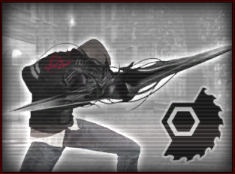
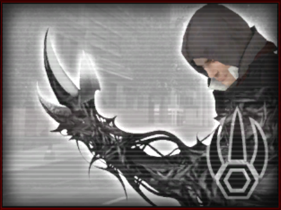
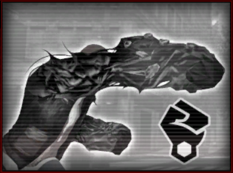
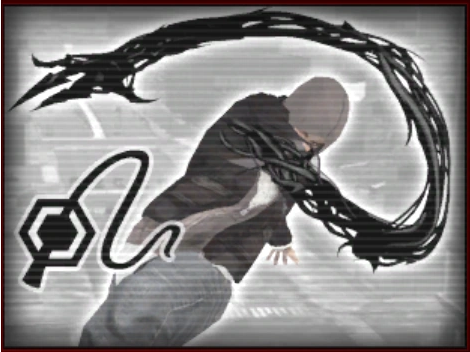
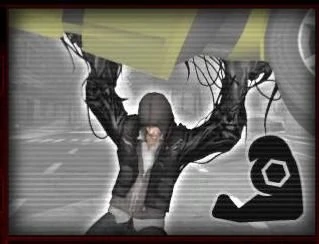
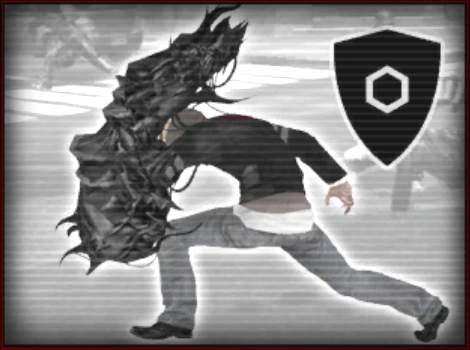
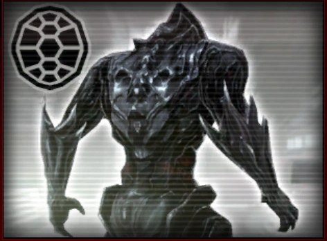
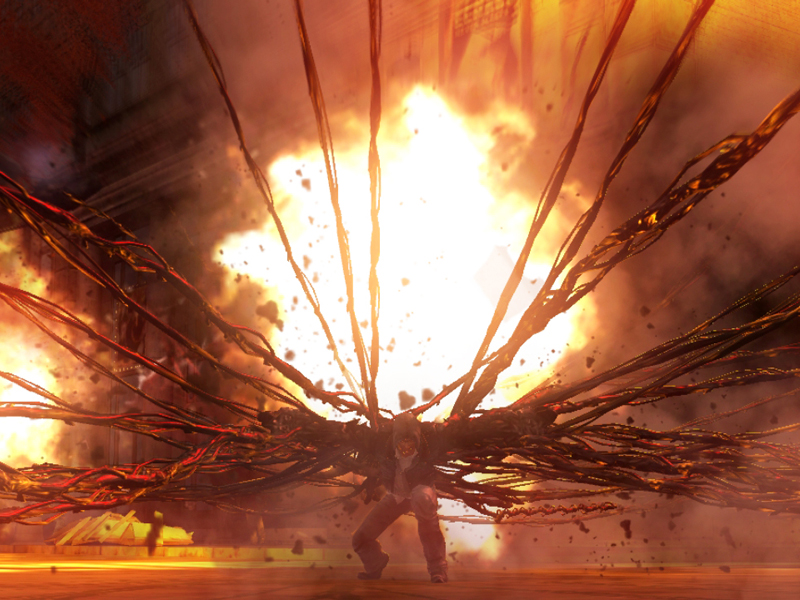
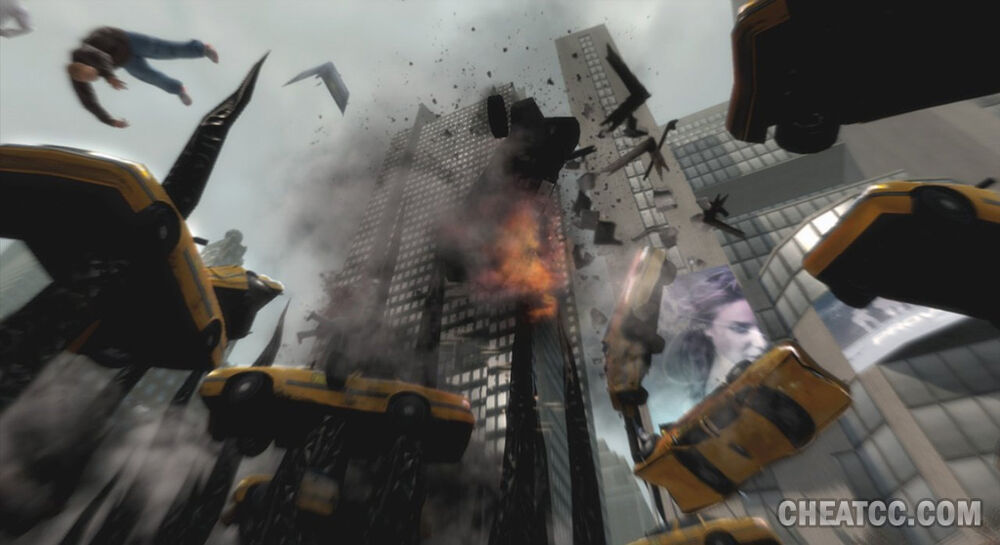
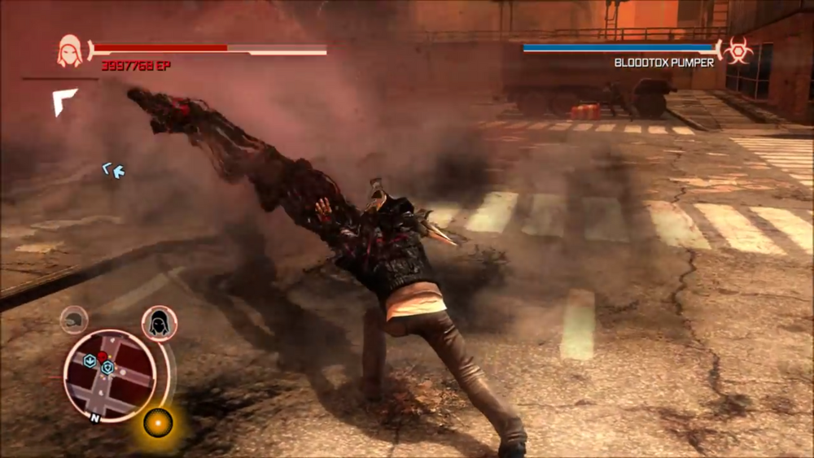

# 黑光病毒原型体

**需要注意的是，《虐杀原形1》与《虐杀原形2》可以视为两个并不完全一致的世界观。本资源的主要设定和表现以背景更加完善的《虐杀原形1》为主。

自地球的第一个生命诞生起时，黑光病毒便已经在地球上存在了。它可以激活生物的非编码区DNA，激发生物的潜在机能。在进入多细胞生物体内后，它会同化并改变每个细胞，并进行大量复制粘贴，导致感染体本身发生剧烈的生理变化。但是，在大多数生物身上，这些变化都会显得过于剧烈。99.9%的被感染体的生理组织在感染之后都会失去活性，引起体内大规模器官衰竭而导致死亡；但是，剩下的存活者，几乎都得到了进化。

1989年，一家名为简泰克（GENTEK，即gene technology的拼造词）的公司成立，开始持续与黑色守望――目前掌握着黑光病毒“母体”的组织――合作，并研究黑光病毒。在这之后，他们招募了一位名为亚历克斯・墨瑟（Alex Mercer）的年轻科学家开始负责这个项目。在研究中，亚历克斯・墨瑟发现这些病毒具有模仿、储存宿主记忆和遗传信息的潜在能力，并在进一步研究之下激发了病毒可以完美复制宿主基因结构的隐性功能。这个版本的黑光病毒被他命名为DX-1118C。

但是，简泰克公司进行的持续的、不人道的人体实验也引起了一些人的注意。2009年，黑色守望在得知了美国国会山在一场不公开的会议里，提及了将对简泰克展开一系列调查行动后，便立即下令停止黑光计划，并击毙了所有知情者与参与人员以掩盖情报。但是，亚历克斯・墨瑟早有准备，他携带着一小管DX-1118C试图潜逃，并最终在宾夕法尼亚车站前被击毙。在他被击毙前，他将DX-1118C摔碎在地，随即，病毒开始扩散。

几小时后，当“亚历克斯・墨瑟”重新从血泊中站起时，他发现自己失去了大部分记忆，而周围则是各种变异的行尸走肉……《虐杀原形1》的故事由此开始。而实际上，此时的“亚历克斯・墨瑟”已经被DX-1118C转化为了几乎全部由生物质组成的，仅依靠病毒中储存的记忆才将自己塑造为人形的一种崭新生物，他，或者说它，就是黑光病毒寻找的全新进化方向，黑光病毒原型体（The Prototype）。

强化限制：肉体的主体需为自然人类

价格：S+9600

效果：

在强化后，你的原本肉体会在1~8个小时被黑光病毒在细胞层面上逐渐替换。在替换完成后，你会保留你的记忆和其他强化，并获得【拟态】、【吞噬】、【进化】、【生存】四个特性。

特殊的，此血统并不会为你提供自由属性点。

【拟态】

*“太不可思议了，他能操控他身体的基因等级。”

你可以改变自己的基因结构来做到极度夸张、乃至不可思议的事情。你可以根据自身想法来改变自己的样貌、声音与服饰。*
作为黑光病毒原型体，你的全身上下均由生物质（Bio mass）构成。这使得你不再需要脆弱的骨骼与内脏来支撑生命，也没有通常意义上的要害。因此，你获得以下效果：

-你的生命值变为结构值，失去冲击和恶性伤害槽，受到冲击、严重、恶性伤害都直接扣减你的结构值；治疗你生命的能力也改为恢复你的等量结构值，在判断医疗点消耗时，如同严重伤害般消耗。当你的结构值归零时，你会立即死亡。

-无需进食、饮水、睡眠、呼吸；

-免疫S级以下、创伤来源的效果；

-免疫受到的坠落伤害；

-只要你还未死亡，你的肢体被切断时，会立刻重生；

-以一个迅捷动作，病毒可以由内而外地改变你的外表，将你变为一个你曾经见过的、体积（包含装备在内）相差不超过±1的单位。这个拟态包含了对方的相貌和衣着装备，持续时间无限；但是，你的衣着和装备总是徒有其表的模仿品，因此不会给你带来任何数据上的好处或坏处。在拟态时，你本身具有的装备仍然会发挥作用，但如果你需要连体积较大的装备一起伪装时，可能会让你的拟态外形没有那么完美（例如，当你穿着一件覆盖全身的重装甲使用此能力来拟态一个穿着普通防弹衣的士兵时，生物质需要将盔甲包裹，整体呈现出一个人穿着防弹衣的形态，可能会导致拟态出的人比原来胖一圈），由ST判断。此效果被视为一个C级、变形来源的效果。

*附注：通常来说，在你进行此强化之后仍然保持着强化之前的外形，即是拟态在发挥作用。

【吞噬】

你获得一个特殊的动作：吞噬。你可以将其结合在一次以你的天生武器切实触及到的、对通常意义上的碳基生物发动的攻击中。如果这一击杀死了敌人，组成你身体的黑光病毒会蔓延至那个生物身上，在极短时间内将其肉体分解为完全的生物质并吞噬到你的体内。在吞噬后，你可以立刻恢复等同于[那个生物耐力上附加成功数（至少为1）]的结构值，但你在每轮中因此恢复的结构值无法超过[你耐力上的附加成功数*2]，医疗点无限。

即使你没有吞噬单位，黑光病毒也会缓慢的修复你的身体结构。你每分钟自动恢复1点结构值，与吞噬共用医疗点。

额外的，你可以使用一种特殊的吞噬方式：对于一个已经处于无助或者自愿状态下的单位，以一个整轮动作使用，这视为一次致命攻击。在杀死对方之后，除了正常吞噬的效果以外，你还会以极快的速度浏览对方的记忆，并且提炼出你希望搜索到的记忆片段，这被视为一个S级、附身来源的获知效果。浏览记忆会为你带来巨大的精神压力，因此，你必须有明确的指向目标（如，“我要搜索他记忆中有关爱丽丝如何离开基地的片段”）；并且，你浏览的记忆片段每有十分钟，你就会在原地陷入震慑状态1轮，并且与通常的震慑不同，你在同时会被视为无助状态。

特殊的，当你使用吞噬后，你可以以一个自由动作进行拟态，将自己的形象改变为你刚刚吞噬的对象的形象。

【进化】

*黑光病毒能够容纳更多优质基因改造身体，提高细胞活动。通过吸收其他生命体筛选出更加适合生存进化的基因。*
你获得[进化槽]，这是一个特殊的计数槽，初始进度为0，没有上限。每当你发动【吞噬】时，根据你吞噬的对象的属性和技能获得好处：

-如果你吞噬的对象的某项属性高于你，你的[进化槽]增加你那项属性的进度。（例如，你的耐力值为11，当你吞噬了一个耐力值为13的角色时，你的[进化槽]+11；技能槽亦同）

-如果你吞噬的对象的某项技能高于你，你的[进化槽]增加你那项技能的进度。

-如果你吞噬的对象的所有属性和技能皆不高于你，则你的[进化槽]进度+1。

你可以花费一个整轮动作，消耗等同于你当前某项属性或技能值的[进化槽]进度（至少为1），来将那项属性或技能值+1；或者消耗你当前某项专业等级的[进化槽]进度（至少为1），来将那项专业等级提升3级。此效果每部影片至多生效20次。因此获得的属性视为你通过强化而获得的自由属性。

【生存】

当你死亡时，构成你身体的大部分生物质会崩毁并自然消散。但是特殊的，在你死亡的地方，会留下一些由生物质伪装的生物组织，最常见的外表是散乱、粘稠的血肉（注意，这些组织并不视为你的尸体，你的尸体已经崩散了）；注意到、并且长期观察这些组织的人会发现，这些组织是“活着的”，当一个通常意义上的碳基生物接触（也包括食用等情况）到这些生物组织后，它们会黏附在那个生物上。

如果目标是一个未经任何强化、最高属性不超过5的普通生物，那么，这些生物组织会以每体积2小时的速度感染并蔓延至那个生物的全身。当感染完成后，这个生物就视为死亡，与黑光病毒原型体一样，它的体内会被完全替换为生物质，只是由于“拟态”特性的生效才维持了原本的模样。接着，它会开始以那个生物的行动方式，寻找体积更大的生物，并继续感染。

如果目标是一个有支线的生物，那么，这些生物组织会拟态为那个生物本身的一部分（通常是皮肤），并缓慢地、无法察觉地吸收能量。在这个过程中，被攀附的生物不会受到任何影响。吸收能量的速度为那个生物的每点耐力2小时，当吸收的能量总量等同于该生物的耐力后，生物组织会脱落，并寻找下个目标。

当感染的生物总体积与吸收能量的总量累计达到10――在通常的自然界中，这个过程花费的时间通常不超过一日――后，你会重生。这是一个S级、附身来源的复活效果。

#######技能树#########

在开启黑光病毒的技能树时，你可以选定武技下的拳、刀、鞭、爪、腿专业中的一项；在这之后，你可以以你选定的专业，代替技能树中提到的其他四项专业的检定。

例如：玩家毒液选择了拳专业；在使用刀锋进行攻击（力量+武技：刀）时，他可以以拳专业替换其中的刀专业，以力量+武技：拳进行刀锋的攻击。

**选开规则：突破形态的桎梏！

注意，这是一个默认关闭的选开规则。

在开启后，ST可以允许玩家通过【进化】来获得超出原著游戏的力量。玩家每消耗了10点进化槽，他就可以选择一项技能树中的【形态】，令其可以与其他形态同时生效。

刀锋（Blade Power）

价格：D+500

介绍：这是一种强大而致命的切割和穿刺武器，它可以完美地切开和刺穿哪怕是最坚硬的装甲车或者猎手的皮肤。

效果：消耗一个迅捷动作，你可以将右手变为一把窄长的双头刀。

这把新的武器仍然视为你的天生武器，因此其武器伤害与你原本右手的天生武器伤害保持一致，但其分类和专业改为“刀”；其体积为3，如果需要判断其具体种类时，视为“佩刀”（但它并不具有佩刀的基础特性，以下其他的形态亦同）；它额外具有破甲5。

这是一个【形态】，你只能同时维持一种【形态】，并获得其好处。

空切刃（Blade Air Slice）

强化前提：刀锋

价格：C+1500

介绍：用这种下坠的切割攻击，将你的敌人切成两段。

效果：只有在“刀锋”形态下，且处于空中时才能使用。以一个标准动作，你立刻向下坠落，并对空中的、你坠落路径直线上的所有单位进行一次攻击；若你在这次攻击中坠落到地面上，则坠落到地面上时的攻击改为对你触及范围内的所有单位进行。

在这次攻击中，你每坠落3米，就额外获得1个附加成功，增强加值，最多因此获得4个附加成功。

狂热刀锋（Blade Frenzy）

强化前提：刀锋

价格：B+2000

介绍：从原地开始释放一系列猛烈的攻击。

效果：只有在“刀锋”形态下可以使用。每回合一次，当你进行第五次攻击时，这次攻击的伤害增加一半。

*注意，此效果不但对可以造成实际伤害或者异常点数的攻击起作用，对于那些在资源中说明造成了攻击次数的（例如“视为已经进行了4次攻击，但是这些攻击次数仅会令对手防御-4”）同样生效。

疾舞刀锋（Blade Sprint Frenzy）

强化前提：狂热刀锋

价格：C+1500

效果：只有在“刀锋”形态下可以使用。以一个标准动作，你可以使用刀锋进行一次冲锋攻击；在这次冲锋攻击中：

-你仅能移动等同于你移动速度的距离，而非通常冲锋动作的移动速度×2；

-对经过路径上所有的敌人进行一次攻击，且在这次攻击前视为你已经攻击了他们4次般令他们承受多次攻击的减值；

-不会令你承受冲锋带来的防御减值；

-每冲锋3米，就在这次攻击中额外获得1个附加成功，增强加值，最多因此获得4个附加成功。

爪（Claws Power）

价格：D+500

介绍：将你的手变为致命的利器，控制并肢解任何胆敢靠近你的群体。

效果：消耗一个迅捷动作，你可以将双手变为一对利爪。

这把新的武器仍然视为你的天生武器，因此其武器伤害与你原本双手的天生武器伤害保持一致（如果双手有区分，则取双手的最高者），但其分类和专业改为“爪”；其体积为2，如果需要判断其具体种类时，视为“铁爪”；它在攻击护甲值不高于5的单位时，具有+4DP的增强加值。

这是一个【形态】，你只能同时维持一种【形态】，并获得其好处。

疾走切割（Dashing Slice）

强化前提：爪

价格：D+500

介绍：切割、撕砍、脱离。

效果：只有在“爪”形态下才可以使用，以一个整轮动作，你可以使用爪进行一次冲锋攻击；在这次冲锋攻击中：

-在进行攻击后，若你的移动距离还有剩余，则可以继续移动，直到你消耗完这次冲锋可以移动的所有移动距离。

-冲锋的路径无需直线，但你需要视为机动性为普通一般来规划你的移动路线。

地面尖刺（Groundspike）

强化前提：爪

价格：B+2000

介绍：将你的生物质变为致命尖刺，在你的敌人下方爆发。

效果：只有在“爪”形态下才可以使用。以一个整轮动作，你选定一处距离你15米内的、通常意义上的地面，然后将手爪插入地下；接着，以目标点为中心、半径2米范围内的地面会立刻生长出朝向正上方、高达5米的、血肉构成的尖刺。你立刻以爪对范围内的所有单位进行一次攻击，范围内的所有单位都需要以强韧豁免对抗，并受到等同于你胜出数的穿刺伤害；在此攻击中至少受到1点伤害的单位还会再承受等同于你胜出数的流血点数，以标准方式豁免。

你在使用地面尖刺时，具有A级措手不及的效果。但与通常的措手不及不同，它只会令目标失去反射动作（而不产生通常措手不及会带来的其他后果）。

在这次攻击结束后，尖刺会立刻消失。

升级：你可以花费C+1000对地面尖刺进行升级。升级后，你获得以下好处：

-地面尖刺的选定距离、尖刺生长的范围和高度均变为上文中原始数值的两倍。

-在这次攻击中，爪提供的增强加值额外增加2个附加成功，且只要被攻击单位的护甲值不高于25就能生效。

-每回合一次，地面尖刺所造成的最终伤害增加一半。

锤拳（Hammerfists Power）

价格：D+500

介绍：用速度换取力量――将生物质转移到你的前臂，以进行致命的范围攻击，碾压装甲敌人、粉碎装甲车。

效果：消耗一个迅捷动作，将你的双拳进行强化。在使用它时，你的攻击DP-8，但具有+3附加成功，增强加值。

这是一个【形态】，你只能同时维持一种【形态】，并获得其好处。

锤拳击倒（Hammerfist Smackdown）

强化前提：锤拳

价格：C+1750

介绍：用这个强大的连击，把你路上的敌人轰出去。它很慢，但是很强大――尤其是对付装甲的敌人时。对速度更快的对手要小心使用。

效果：只有在“锤拳”形态下才可以使用，以一个整轮动作，你可以使用锤拳进行一次全力攻击；在这次全力攻击中：

-这次攻击不通过通常的防御，而是进行一次攻击检定，对触及范围内的所有敌人造成钝击严重伤害，反射豁免。

-取代全力攻击的+2DP，而是改为具有-4DP和+2附加成功的增强加值。

-在这次攻击中具有【会心1】。

-在这次攻击中受到伤害的单位会被击倒。

飞锤（Hammertoss）

强化前提：锤拳击倒

价格：D+500

介绍：冲刺，接着将自己投掷出去。如一柄流星锤一般，把你所有的重量集中在下一次攻击中。当你失误时，飞锤是危险的；当你击中时，飞锤是致命的。

效果：只有在“锤拳”形态下才可以使用。以一个整轮动作，你进行一次冲锋攻击。在冲锋的移动过程中，你需要进行一次跳跃检定，这次跳跃视为已助跑；接着：

-在这次跳跃结束时，你的冲锋便宣告结束，并按照本次跳跃的实际距离（通常来说，是这次跳跃检定的成功数*1.2米）计算本次的冲锋距离和应当获得的加成；

-对跳跃的落点进行一次【锤拳击倒】的攻击，但不获得全力攻击的加成（也包括锤拳击倒中替代全力攻击的加成）

-本次冲锋带来的防御减值加倍计算，且减少的是你基础防御+闪避防御+洞察防御的总和。这不会影响你获得的冲锋加值。但是，如果你已经强化了【疾舞刀锋】，则你每因此实际失去6点防御，就会获得1点攻击上的附加成功，表现加值。

-你的跳跃检定成功数每有3点，就在飞锤的攻击检定中获得1附加成功，表现加值；因此至多获得3点。

锤轰肘（Hammerfist Elbow Slam）

强化前提：飞锤

价格：C+1000

介绍：跳起，落下。对装甲单位的致命攻击。增加额外的高度来增加你的伤害和影响范围。在适当的条件下，你可以一击击碎敌人的坦克。

效果：只有在“锤拳”形态下才可以使用。以一个整轮动作，你进行一次冲锋攻击。取代冲锋的移动，你需要进行一次跳跃检定，这次跳跃视为已助跑，并且跳跃方向必须是竖直向上的；接着：

-你立刻向下坠落。在坠落到地面上时，你的冲锋便宣告结束，并按照本次跳跃的实际高度（通常来说，是这次跳跃检定的成功数*0.6米）+坠落的实际距离，计算本次的冲锋距离和应当获得的加成；

-对跳跃的落点进行一次【锤拳击倒】的攻击，但不获得全力攻击的加成（也包括锤拳击倒中替代全力攻击的加成）。

-如果你已经强化了【疾舞刀锋】，则不会因为这次冲锋失去防御。

-在这次攻击中，你每坠落3米，就额外获得1个附加成功，增强加值，最多因此获得3个附加成功。

-在这次攻击中，你每坠落3米，就无视对方1点DR/-，最多因此无视4点。

-在这次攻击中，你每坠落1米，就视为增加1米的触及范围，最多因此增加16米。

特殊的，若你原本就在空中，你仍然可以以一个整轮动作使用此技能。此时，你无需进行跳跃检定，而是直接将你坠落的高度翻倍计算。

鞭拳（Whipfist Power）

价格：D+500

介绍：将你的手臂变形为一种纤细、灵活，如刀刃般锋利的鞭刃，可以用来进行超远距离攻击，或者攻击整群敌人。

效果：消耗一个迅捷动作，你可以将右臂变为一条长鞭。

这把新的武器仍然视为你的天生武器，因此其武器伤害与你原本右手的天生武器伤害保持一致，但其分类和专业改为“鞭”；其体积为3，如果需要判断其具体种类时，视为“长鞭”，但造成的是挥砍严重伤害。

这是一个【形态】，你只能同时维持一种【形态】，并获得其好处。

清道夫（Street Sweeper）

强化前提：鞭拳

价格：D+500

介绍：用鞭拳横扫并肢解所有附近的敌人。

效果：只有在“鞭拳”形态下才可以使用，以一个标准动作，你可以使用鞭拳对触及范围内的所有敌人进行两次攻击，但每次攻击的成功数皆减半计算。

远程抓取（Longshot Grab）

强化前提：鞭拳

价格：C+1000

介绍：如果有敌人在远处，用远程抓取把他们拉回来；或者使用它来抓住、并将你自己拉向直升机。

效果：在“鞭拳”形态下才可以使用。每回合一次，当你命中一个敌人时，你可以与其立刻进行一次力量鉴定对抗：若你获胜，你可以选择将对方拉近5米，或者将自己向对方拉近5米；若你失败，则你只能选择将自己向对方拉近5米。

最后，当你强化了此能力后，鞭拳的触及范围会增加4米。

升级：你可以花费250分对远程抓取进行升级。每次升级可以选择以下的三个效果之一：

1、鞭拳的触及范围+1米

2、远程抓取将对方多拉近5米

3、远程抓取将自己向对方多拉近5米

超量肌肉（Musclemass Power）

价格：A+4000

介绍：令你的力量翻倍提升，投掷的更远、所有攻击造成更多伤害。

效果：每回合首次，你以力量作为关键属性进行的攻击，最终伤害增加一倍。

你以力量作为关键属性进行的投掷攻击，其基础射程增加160米。

肌力增强（Musclemass Boost）

强化前提：超量肌肉

价格：9000分

效果：在进行力量鉴定时，你额外具有等同于你耐力值的DP。

巨力投掷（Musclemass Throw）

强化前提：超量肌肉

价格：D+500

效果：你以力量作为关键属性的投掷攻击，其基础射程额外增加160米，并且减少4点远程攻击承受的距离减值；若射程减值已经为0，则减少的每2点减值都改为增加一倍无需承受距离减值的射程单位。

护盾（Shield Power）

价格：12000分

介绍：当Alex使用护盾能力时，大量的生物质被转移到他的左臂上，将其塑造成一个几乎无法穿透的黑色生物质盾牌。护盾会在受到攻击时吸收伤害，完全保护你的生命值，直到它被破坏为止。但是一旦被破坏，护盾必须重新恢复才能再次抵消伤害。

效果：消耗一个自由动作，你可以将左臂变为一面盾牌。

这把新的武器仍然视为你的天生武器，因此其武器伤害与你原本左手的天生武器伤害保持一致，但其分类增加“盾”；其体积为4，如果需要判断其具体种类时，视为“重盾”。当你希望使用它进行攻击时，仍然视为使用拳进行攻击。

在持有它进行格挡时，你如同正常使用天生武器进行格挡，但额外的，你可以选定一个方向，你在面对自该方向的攻击时，具有12点临时生命值和4点全伤害吸收，这表现为护盾为你抵挡了所有攻击。护盾提供的临时生命值在你每回合开始时都会回复到满值。但是，若你在护盾状态下失去了护盾提供的全部临时生命值，则护盾会破碎，你会强制退出护盾形态，并视为失去格挡状态。直到你的下个回合结束后，护盾才会恢复，你才可以再次使用护盾能力。

这是一个【形态】，你只能同时维持一种【形态】，并获得其好处。

装甲（Armor Power）

强化前提：护盾

价格：12000分

介绍：与护盾不同，在装甲能力启动时，大量的生物质会完全包裹Alex的身体，永远不会破碎。它不像护盾那样可以完全吸收伤害，而是将其抵消一部分，以此提高整体防御力，但会牺牲一定的运动能力。Alex通常在穿过敌军装甲车和小型单位的混合阵线时使用它。

效果：消耗一个自由动作，你可以获得一套全覆式盔甲。在装甲形态下，你：

-移动速度减少为原本的一半。

-运动鉴定-10DP。

-无法使用滑翔能力。

-具有20点盔甲防御加值，和8点盔甲减值。特殊的，如果你通过某些方式抵消了这些盔甲减值，那么上文中的其他三项负面效果你也无需承受。

-每当你受到伤害时，会抵消其中的2/3，向上取整，但每次伤害至多抵消16点。在判断中，这视为一类全伤害吸收。

这是一个【形态】，你只能同时维持一种【形态】，并获得其好处。但特殊的是，在启动装甲形态时，你可以同时启动刀锋形态，并获得其好处。

红外视觉（Thermal Vision Power）

价格：B+2000

效果：以一个自由动作开启或关闭。

在开启后，你会以热源区分视野范围内的单位。在判断中，你获得B级、特异本质的侦测能力，并且具有【透视】关键字。

感染者视觉（Infected Vision Power）

强化前提：红外视觉

价格：B+2000

效果：红外视觉提供的侦测能力等级变为A级。

当侦测目标是黑光病毒感染者时，侦测等级视为提升到S级。

滑翔（Glide）

价格：C+1000

效果：在空中时，你可以操纵自己的四肢在空中滑翔。在判断中，你视为获得了飞行能力，机动性普通。

但是，你在“滑翔”期间无法自主向上方飞行，每滑翔一轮，你的飞行高度就需要下降1米。

空中冲刺（AirDash）

价格：D+750

效果：当你在空中时才能发动（这包含了你在飞行、滑翔，甚至仅仅是在某次跳跃的过程中）。每回合一次，你可以以一个迅捷动作向任意方向移动5米。

购买后，你滑翔的机动性上升一级。

二次空中冲刺（AirDash Double）

购买前提：空中冲刺

价格：D+750

效果：你每个回合可以使用两次“空中冲刺”。

购买后，你滑翔的机动性再上升一级

攀墙（Wall Crawling/Wall Running）

价格：750分

介绍：Alex将生物质引导到他的手上和脚上，以在墙壁上进行攀爬或奔跑。

效果：你获得等同于移动速度的攀爬速度，并且可以在任何固体表面上站立或奔跑。

空中受身（Air Recovery）

购买前提：空中冲刺

价格：C+1500

效果：每回合一次，你可以以自由动作施展空中冲刺。此效果可以在回合外使用。

当你以此方式使用空中冲刺后，若你原本处于倒地状态，你立刻起身。

翻滚（DiveRoll）

价格：500分

购买前提：空中冲刺

效果：你可以在地面上施放空中冲刺。此时，你的动作表现为翻滚。

购买后，你的空中冲刺距离+10米。

精灵之速（Sprint Speed）

价格：B+2000

效果：你的移动速度增加80米。

在你的回合中，若你消耗了一个移动动作以上，进行包含移动行为的动作（例如，使用标准动作+移动动作进行两次移动，或者整轮动作冲锋都算），那么你首次移动距离增加一倍。

跳跃强化（Jump Upgrade）

价格：750分

效果：你的跳跃距离翻倍

临界质量（Critical Mass Ability）

价格：5000分

效果：当你的生命值已经为满值时，当你通过【吞噬】恢复结构值时，可以改为获得等量的临时生命。因此获得的临时生命最多10点。

当你具有因此效果带来的临时生命值时，你被视为处于【临界状态】之中――它不会给你带来什么特别的效果，但只有在【临界状态】中，你才能释放一些威力巨大的技能。

热情喷发（Adrenaline Surge）

价格：S+8000

效果：当你受到致命伤害时，你免疫此伤害（这是一个S级、毒素/药物来源的无敌效果），并且你立刻恢复16点结构值。

此效果每场景只会生效一次。

在你触发本技能后，直到你的下一个回合结束，你被视为处于【临界状态】之中――它不会给你带来什么特别的效果，但只有在【临界状态】中，你才能释放一些威力巨大的技能。

生命加强（Health Boost）

价格：2500分

效果：你的生命上限提高5点。

再生加强（Regen Rate Boost）

价格：250分

效果：在【吞噬】能力中，你每分钟自动恢复的结构值改为5点。

延迟再生（Regen Delay）

购买前提：再生加强

价格：500分

效果：在【吞噬】能力中，你改为30秒（5轮）恢复5点结构值。

飞踢（Flying Kick Boost）

价格：D+500

效果：只有在空中时才能使用。以一个标准动作，你立刻移动到离你5米内、且处于你下方的一个敌人面前，并以天生武器-腿对其进行一次攻击。

在这次攻击中，你额外获得+1DP和+1附加成功的速度加值。

身体冲浪（Body Surf）

价格：500

效果：只有在“飞踢”命中了一个单位，且该单位已经死亡或进入无助状态才能使用，且该单位的身体体积应当不高于你的体积+2，不低于你的体积-1。

你立刻以自由动作将该单位踩踏在脚下，并且如同冲浪板一般滑行，在此状态下，你的移动速度+10米，但机动性下降1级。

身体冲浪状态会持续至多5轮；或者，你可以随时以一个自由动作将该单位的身体投掷出去，并结束这次身体冲浪。这次投掷不会造成伤害。

空中踩踏（Air Stomp）

价格：C+1500

效果：此技能产生的效果与“空切刃”完全一致，但不同的是，你可以以天生武器-腿，而非“刀锋”进行攻击。

若你已经购买了“空切刃”，则免费获得“空中踩踏”（自然，赠送的技能不会获得自由属性点），反之亦然。

子弹俯冲（Bulletdive Drop）

购买前提：锤轰肘

价格：C+1500

介绍：在滑行中切开空气，猛烈地、快速地向下俯冲，形成一个大范围的喷溅伤害。子弹俯冲不能很好的追踪对手，但它具有强有力的攻击性，是最强的空对地攻击技能。

效果：此效果与“锤轰肘”完全一致。但不同的是，你是以天生武器-腿，而非“锤拳”进行攻击。此外，你还会获得以下效果：

-在这次攻击中，可以将攻击DP以3:1的比例转化为攻击上的附加成功，以此方式最多转化等同于你耐力值两倍的DP。

-在这次攻击中，你每坠落3米，就在攻击中无视1点任意伤害吸收、减免，最多因此无视4点。

-在这次攻击中，你每坠落1米，就视为增加5米的触及范围，因此获得的触及范围最多等同于你的敏感范围的一半。此效果会覆盖“锤轰肘”的类似效果。

碎地者（Groundshatter）

购买前提：锤拳击倒

价格：D+500

介绍：重击地面，将附近较弱的敌人锤击上天。

效果：此技能产生的效果与“锤拳击倒”完全一致，但不同的是：

-你可以以普通的天生武器-拳，而非“锤拳”进行攻击。

-在这次攻击命中敌人后，你可以以一个自由动作，对被命中的敌人进行一次冲撞；这次冲撞只能选择击退，且击退的方向必须是竖直向上的。

升龙拳（Uppercut Launcher）

购买前提：碎地者

价格：D+500

效果：消耗一个标准动作，你对触及范围内的所有敌人进行一次攻击。这次攻击：

-其效果和数值与“碎地者”一致，但表现方式是进行一次上勾拳攻击。

-在攻击命中后进行的冲撞中，与通常的冲撞不同，你每个胜出数可以将对方向上击飞3米（而非正常冲撞行为的1米+每3胜出数1米），最多因此将对方击飞25米。

-在将对方击飞的同时，你可以与对方一同升起，最多升起到不超过你移动速度一半的距离。

空中连击（Air Combo）

购买前提：升龙拳

价格：B+2000

效果：仅在自己处于空中时，对处于空中的单位才能使用。以一个移动动作，你可以进行一次普通近战肉搏攻击。

此技能每回合仅能使用一次。

道钉机（Spike Driver）

购买前提：空中连击

价格：B+2500

效果：仅在自己处于空中，且对在本回合中，被你“空中连击”攻击命中的单位才能使用，以双拳将空中的敌人重击向地面。

以一个迅捷动作，你可以进行一次普通近战肉搏攻击。若本次攻击造成了伤害，则令那个敌人立刻结算坠落（而非通常的在回合结束时结算），此时：

-如果那个敌人具有免疫坠落伤害的能力（如飞行），那么你立刻投掷16DP，对那个敌人追加造成等量的钝击严重伤害；

-如果那个敌人不具有免疫坠落伤害的能力，那么在结算这次坠落伤害时，他的反射豁免-16DP。

此技能每回合仅能使用一次。

万千触须・终结一切（Tendril Barrage Devastator）

购买前提：临界状态

价格：A+4000

介绍：最强力的技能之一，致命的卷须从身体中喷射出来，刺穿周围大范围内的所有敌人，对生化敌人极其有效。

效果：你只有在【临界状态】中才能释放此技能。以一个标准动作，并且对你自己造成4点不可吸收减免的伤害，你的身体中爆发出无数触须，对你的敏感范围内所有单位进行一次近战攻击。这次攻击：

-可以选择使用你的任何天生武器，或技能树中的任意“形态”。

-如果受到攻击的单位是生物，则对他们的攻击DP无需检定，直接取10（不会带来加骰），这是一个A级、附身来源的即死效果。

-无视受到攻击的单位的闪避防御，这是一个A级、附身来源的效果。

-视为具有【超级贯穿】特性。

特殊的，如果你已经购买了墓尖灭杀或致命痛楚，那么本技能的价格改为B+2000。

墓尖灭杀（Groundspike Graveyard Devastator）

购买前提：临界状态、地面尖刺

价格：A+4000

介绍：最强力的技能之一，向周围爆发波浪般的地刺。对于装甲敌人极其有效，但对于生化敌人的伤害则不如万千触须・终结一切。

效果：你只有在【临界状态】中才能释放此技能。以一个标准动作，并且对你自己造成4点不可吸收减免的伤害，将双手插入地下，制造无数的地面尖刺进行攻击。这次攻击：

-可以选择使用你的任何天生武器，或技能树中的任意“形态”进行这次攻击。

-地面尖刺会从以你为中心的地面中生出，半径是你的敏感范围，地面尖刺的高度也同样等同于你的敏感范围；若你此时在空中，那么你会先坠落到距离你最近的地面，然后使用此技能。

-如果受到攻击的单位具有合计10点或更高的盔甲和天生防御，则对他们的攻击DP无需检定，直接取10（不会带来加骰），这是一个A级、附身来源的即死效果。

-你在攻击DP中获得额外的增强加值，数值为你的攻击范围内所有敌人的盔甲和天生防御之和，但至多不超过你的耐力值的一半。

-攻击不通过防御，而是受到攻击的所有单位都需要以强韧豁免你的攻击成功数，并受到等同于你胜出数的穿刺严重伤害。

-在此攻击中至少受到1点伤害的单位还会再承受等同于你胜出数的流血点数，以标准方式豁免。

-你在使用墓尖灭杀时，具有S级措手不及的效果。但与通常的措手不及不同，它只会令目标失去反射动作（而不产生通常措手不及会带来的其他后果）。

特殊的，如果你已经购买了万千触须・终结一切或致命痛楚，那么本技能的价格改为B+2000。

致命痛楚（Critical Pain Devastator）

购买前提：临界状态

价格：A+4000

介绍：最强力的技能之一。致命痛楚能对发射直线上的任何敌人造成不可估量的伤害。对付强大的、或者擅长回避的敌人特别有效。

效果：你只有在【临界状态】中才能释放此技能。以一个标准动作，并且对你自己造成4点不可吸收减免的伤害，将双手向前推，巨量生物质将化作宛如攻城锤一般的高速、强劲的冲击：

-在正式进行攻击前，你需要选定一个方向，以你为起点、距离最远到你敏感范围、处于你选定方向的一条直线上的敌人都需要进行一次强韧豁免，DC为你的耐力值；失败的单位会陷入定身状态，这是一个A级、附身来源的效果。接着，你对这条直线上的所有敌人进行一次攻击，这次攻击不通过防御，而是受到攻击的所有单位都需要以强韧豁免你的攻击成功数，并受到等同于你胜出数的穿刺严重伤害。

-这次攻击（以及在此之前的定身效果）皆具有【传送攻击】关键字，这是C级、附身来源的效果，因此通常来说，这次攻击与其之前的定身效果皆无视通常的障碍物。

-可以选择使用你的任何天生武器，或技能树中的任意“形态”进行这次攻击。

-如果受到攻击的单位已经陷入定身状态，则对他们的攻击DP无需检定，直接取10（不会带来加骰），这是一个A级、附身来源的即死效果。

特殊的，如果你已经购买了万千触须・终结一切或墓尖灭杀，那么本技能的价格改为B+2000。

伪装（Disguise Power）

价格：100分

介绍：表面伪善是你的面具。

效果：你的【拟态】在改变外表时仅需一个自由动作，而非原本的迅捷动作。

隐秘吞噬（Stealth Consume）

价格：C+1000

介绍：悄无声息地吸收敌人，在潜入基地时尤其有效。

效果：你只有在拟态状态下、且没有使用任何一种【形态】时，才可使用此技能。你可以对自己相邻的敌人进行一次攻击，如果这次攻击成功击杀了敌人，你可以立刻【吞噬】敌人并使用【伪装】变为那个敌人的样子，而周围的敌人不会察觉到这场战斗。

在判断中，你攻击的那一轮视为具有C级、特异本质的反侦测能力；在此效果生效期间，能够定位你的单位会正常察觉到你的战斗行为。

替罪羊（Patsy）

价格：B+2000

介绍：使用伪装技能装扮成敌人的模样，令敌人遭受其队友的攻击。

效果：你只有已经在拟态状态下、且装扮为与敌人同一个阵营的单位外形时，才可使用此技能。

以一个整轮动作指定一个单位，并进行一次说服/唬骗检定；所有距离你不超过40米、且可以听到你说话的敌人都需以冷静对抗。如果他们失败，则会认定你指定的那个单位是由你（或者其他一些危险分子/生物）伪装的，并以自己的逻辑向其发动攻击。

这是一个A级、心灵来源的混乱效果。

挟持装甲车/直升机（Hijack Armored Vehicle/Skyjack Helicopter）

价格：C+1000

效果：对于具有驾驶室和实体驾驶者的机械重载具，且你必须可以精确定位驾驶室内部才能使用。以一个整轮动作，你可以宣称一次“劫持载具”攻击，在这次攻击中：

-如果驾驶室的距离不超过你的移动速度，你可以直接进入驾驶室。这是一个C级、附身来源的传送效果。在画面表现上，你跃上坦克/直升机，轻松撕开了坦克的舱盖或直升机的舱门。

-如果你成功进入了驾驶室，你可以对其中的所有敌人进行一次攻击。

-在这之后，此载具视为失去了对于驾驶舱的防护，任何单位都可以通过你进入的路径对驾驶舱中的驾驶者进行攻击；在判断中，这视为一次部位攻击，但不需要承受任何部位攻击减值（因此，范围攻击无法享受此好处）。

装甲车/直升机熟练（Armored Vehicle/Helicopter）

价格：2500

效果：你的器用检定+10DP，表现加值。

导弹发射器/榴弹发射器熟练（Missile Launcher/Grenade Launcher）

价格：4500

效果：你在使用炮类武器进行攻击时，其炮击伤害增加6点。

机关枪/突击步枪熟练（Machine Gun/Assault Rifle）

价格：2500

效果：你的射击检定+10DP，表现加值
