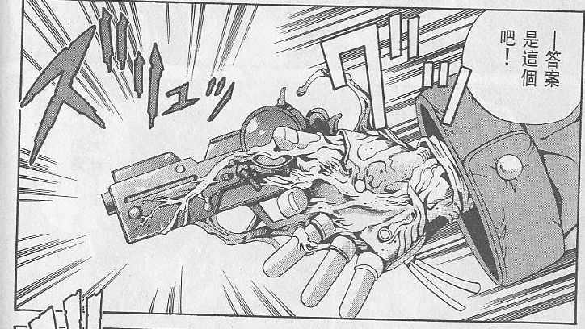

# Eatman螺丝侠能力组

一次性改造

Eatman螺丝侠能力组

C+2400

没人知道他是谁，他从哪里来，他活了多久，人们只知道他是世界第一的冒险家――波特・克拉克

现在你的牙齿在破坏物品时视作可以忽略5点硬度（破坏物品规则选开），你不再需要食用通常意义上的食物就能存活。你的味觉也发生了一定的变化，金属、塑料、木头等材料或制品对于你来说就是一道道菜肴（不一定好吃），而一些小型零件（比如螺丝）对于你来说就是零食。

被你吃下的金属、塑料、木头、机油等材料或完整制品（限定自然本质/科技本质，由于规则原因载具不算在内，st也可以选择开放载具）将会在你体内还原重组并储存起来。存储的空间视为无限，视为一种异空间效果，并且不会令你的体型或体重产生任何变化（也就是说理论上你可以储存一艘宇宙战舰，前提是你先把它吃完）。你可以以一个整轮动作，将被你储存起来的一件材料或完整制品，从你手上“长”出来（也可以是其他地方，比如口部或背部）。你可以选择将其完全“长”出来，脱离你的身体再使用；或者只“长”一部分出来，这不会影响正常使用。但无论“长”没“长”完全，回收的方式依旧是由你自己再吃下去。对于储存的液体（比如汽油）而言，你将其释放的速度较慢，相当于从一个茶壶里倒水。

该能力不会影响你吃正常的食物，你依旧能够正常进食饮水。你进食正常的食物或饮水后会正常将其消化代谢，这意味着你不能通过此能力储存食水，包括饮用后生效的特殊药剂等。

（如果吃下之前结构值不满，长出来后结构值不变）

（配图）

如果你吃下的是半成品或未组合的零件，你可以根据物品制作规则将这些制作成成品（依旧需要图纸解读和足够的材料），但制作时间只需要一个整轮动作（6秒）。

注：如果是类似吃下一个完整的闹钟所有部件（只差拼装就是成品的程度），st可以选择让pc不需要支付额外的xp和支线奖励点直接制作。

你可以无需工具，对被你吃下并储存的物品如常进行操作，比如修复物品或修改物品储存的资料进行修改等。

被你吃下并储存的物品依旧可以正常工作，比如你吃下一个电话，有人朝这个电话打过去，虽然不会发出震动或铃声，但你可以感觉到有人在打电话过来。当然你可以选择不让其正常工作。

只要你不被杀就不会死，你的寿命延长至无限，而身体将在成长至巅峰时期后停止生长（头发依旧会变长，但不会变白，其他类似），这视作C级免疫衰老。同时你将免疫D级药物/毒素和疾病。

技能：

额外支付D+1000，你可以以每轮1点结构值加速被你储存的物品的修复，这种修复只能同时作用1件物品。这种回复依旧需要遵守医疗点规则，医疗点为28，每回复1点结构值消耗1点医疗点。前提依旧需要有足够的修复材料。

从表现上你吃下一只年老失修生锈的古董怀表，然后从手上长出一只崭新的完好的怀表，怀表上的时间还是北京时间。

你可以再支付D+1000，修复速度提高到每轮2点，医疗点提高到56。
