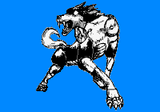

# 哮风之狼

哮风之狼/Howlin'  Wolf

A+4800

能力等级：

破坏力A 速度B 射程B 持续力D 精密动作性B 成长性C

能力定位：中距离力量型

能力评定：狼型替身。能通过远吠放出冲击波。

既然是狼型，自然也能进行啃咬和抓挠的攻击。

力量和瞬间爆发力很强，瞬间破坏力相当可观的替身。

整体来说是平衡性较好的种类。

替身拥有自我意识，至少能自主进食。同时它的性格非常敏感纤细，被说是犬型时还会垂头丧气，对气味并不是很敏感。

虽然被叫做狼型替身，却并不是狼。

替身拥有自我行动的能力，在脱离替身使者独立行动时，可以根据最后的命令和自我判断来进行下一步行动。替身使者与替身之间不存在感官共享和心灵沟通等能力（除非有其他资源支持）。

放出替身是一个迅捷动作，收回替身也是一个迅捷动作。替身拥有自己的动作，命令替身行动不会消耗替身使者的动作。对替身造成的伤害和负面效果也不会传递到替身使者身上。

替身的数据如下：

体积：5

智力：5  感知：16 决心：16

力量：21 敏捷：16 耐力：21

风度：2  操纵：2  沉着：5

武技14-牙14

生存14-强韧11

专注11-意志11

运动11-反射11

洞察11-调查11

隐秘11-潜行11

生命值：35

速度：100

先攻：25

敏感范围：400米

触及范围：60米

天生武器伤害：10L（8加骰，神兵）

意志豁免：40DP+6

反射豁免：40DP+6

强韧豁免：48DP+8

侦查检定：38DP+6

潜行检定：38DP+6

基础防御：16+3附加

替身被视为灵体，替身使者拥有灵感视觉和正常影响灵体和虚体的能力。

替身初始附带【瞪视】【冲撞】【旋风】【抓挠】四个技能

【瞪视】：

通过瞪过别人以施加压力。

标准动作对触及范围内的一个目标进行一次意志检定，目标以意志豁免，失败则这一轮内不能进行移动，这是C级影响心灵的限制行动效果。

【冲撞】：

替身使用身体冲撞别人。

标准动作对触及范围内的一个目标进行一次肉搏攻击检定，并将目标击退等于伤害数*1米。

【旋风】：

替身操纵风的力量攻击敌人。

标准动作对触及范围内的一个目标进行一次肉搏攻击检定，造成力场严重伤害。

【噬咬】：

替身抓挠敌人。

标准动作对触及范围内的一个目标进行一次力量+武技：牙攻击检定，造成物理穿刺伤害。

【骑乘】：

替身使者可以乘坐替身移动。

上狼还是下狼都需要一个移动动作。

能力开发：

【龙卷】：C+1000

替身制造出小型龙卷风攻击单数敌人。

标准动作对触及范围内的一个目标进行一次力量+武技+肉搏相关专业攻击检定，造成力场严重伤害。被命中的目标会被向上击飞25米距离，这轮结束后开始坠落。

另一种运用方式：【龙卷群】

制造出大型龙卷风攻击复数敌人。

将攻击目标扩大为触及范围内的所有敌人。

【风神】：B+2000

替身利用风的力量打击敌人。

标准动作对触及范围内的一个目标进行一次力量+武技+肉搏相关专业攻击检定，造成力场严重伤害。

被命中的目标会陷入B级环境来源的定身状态和B级创伤来源的力竭状态，持续一轮。

同时向上被向上击飞50米，这轮结束后开始坠落。

【犬砂岚】：A+4000

替身利用风的力量打击敌人。

标准动作对触及范围内的所有目标进行一次力量+武技：肉搏相关专业攻击检定，造成力场严重伤害。

被命中的目标会被向上击飞180米，这轮结束后开始坠落。

同时受到伤害的目标会承受等于胜出数的流血异常点数，正常豁免。

被命中的目标会陷入A级环境来源的定身状态一轮。

这次攻击无视目标的闪避防御，这是A级环境来源的效果。
