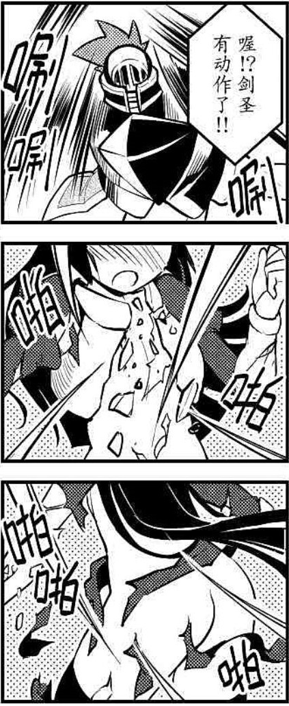

# 剑圣技――圣光崩灭

ST选开：需开放物品破坏规则才可进行强化

剑圣技――圣光崩灭

C+2000

剑圣阿特普斯于迷宫竞技场领悟的极速剑技，这是一种极为可怕的剑技。

你需要手持一把拥有【神兵】特性的武器来使用这个招式，并事先盯着目标至少两轮的时间，在发动前都需要盯着，不过只要期间视线并没有离开目标，那么，你依然可以正常的做其他事情。特殊，如果你有过目不忘专长或类似能力，并且对方在这期间并没有更换防具，那么你可以提前去盯着目标两轮来记住这个目标，而不需要一直盯着，你只能同时这样记住一个目标。

使用一个标准动作发动，你对目标极速挥动武器，夺目的光芒闪耀于此，这次攻击中你对目标身上的所有衣物、盔甲，包括腰带，头绳之类的物品进行攻击。在这次攻击中你额外获得10点破甲，忽视10点硬度，这都属于技艺加值。

升级：C+1000

现在你可以用一个反射动作来观察目标而不需要盯两轮。如果你有过目不忘专长或类似能力，现在你可以同时记住多个目标，但数量不能超过你的智力附加成功数。

你在攻击时的破甲再加5点，忽视的硬度提高4点。并且你可以通过永久摧毁你用来使用招式的武器（至少需要B级）为代价，抵消对方防具的不可损毁特性，效果的支线等级为你手中武器的支线等级+1。

st选开：在你攻击相貌在8以上的生物时，该招式里所有效果+1，相貌每多10，效果再+1。

