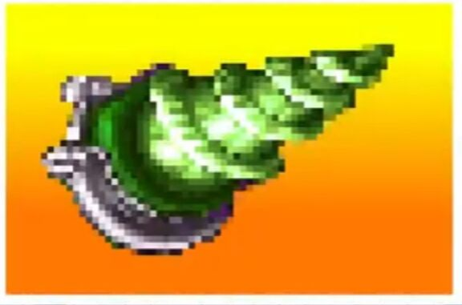

# 超电磁钻头

价格：C+2000

“这是蛇专用的装备，人类是用不了的。”

“那条蚯蚓不也能用吗！”

“那个人在装备着装备着超电磁钻头的蚯蚓发动攻击啊！”

专业分类：见下

本质：科幻

武器伤害9L，并具有【贯穿】；

使用本武器进行攻击时，你只能造成电击能量伤害；并且受到伤害的目标还会额外受到1点不可豁免的麻痹点数。

【蛇专用装备】：你无法正常使用肢体使用超电磁钻头，除非你的体型近似于蛇类（如持有美杜莎诅咒，蛇人血统，魔物娘拉弥亚一类的强化），此时你的尾巴视为仅能用于持有并使用超电磁钻头的可用肢体。使用超电磁钻头攻击时，将其视为一柄体积2的短剑，使用剑专业进行相关检定。

【蚯蚓不也能用吗】：实际上，只要是拥有类似蛇的、长条且柔软的尾部的生物，都可以正常使用并装备超电磁钻头，具体由st判定。

【那个人装备了蚯蚓】：若你并不具备可以正常使用钻头的部位，你也可以选择将一条装备了钻头的、体积不超过3的蛇或蚯蚓作为武器使用。此时，将蛇/蚯蚓与钻头一起被视为异种武器【软剑】，体积3，【刁钻】，你需要在武技下具有【异种武器：软剑】才能正常使用，其他属性不变。

如果你在剧情里没有同意被当作武器甩来甩去的小蛇伙伴，那么也可以向主神申请，花20分购买一条已经被驯服的蛇来满足使用要求。

理所当然的，因此被作为武器装备的蛇/蚯蚓不具备自我行动能力，无法为武器带来其他数据加成。且如果st开启了物品破坏规则，蛇/蚯蚓视为正常的体积2、天生防御1、其他防御0、生命4的生物进行伤害计算，而不是采用正常物品的硬度/结构值规则。
