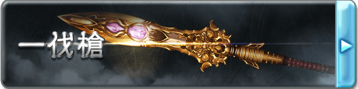

# 一伐枪

■一伐枪（D+500）

汇集了无上的十之力、掌管着无垠的苍天的一切，唯一的贤人-乌诺所使用的长枪。闪耀在刀刃上的是引导黎明的独一无二的光辉，那黄金的刀尖在开辟的天空中闪烁着，将沉入混沌的世界开拓。

作为武器是一把伤害5L的长枪，专业：枪，具有【格挡2】的特性，并且能正常攻击灵体和虚体。

心性暴乱者、满怀杀意者、乐于挑起纷争是非者，会被这把枪拒绝而无法使用乃至持握这把长枪。

■［黎明］一伐枪·真（C+1000）

枪头闪耀宝珠的真意是将开天辟地引导。为了引导黎明的天空而描绘的黄金轨迹，在久远的时光流逝后至今仍未消失，开辟了新的世界。

作为武器的性能得到了提升，格挡提升至5点，并且获得了【破魔5】和【9加骰】，获得特性【抑止的枪尖】。

【抑止的枪尖】

均衡和加害与被害的力量，当自身与一个单位发生战斗时，计算双方在本场景中对对方造成的伤害总值，若攻击方造成的总伤害较高，则其在本次攻击中武器伤害下降伤害的差值，最低到1；反之则会提升伤害的差值，最高为原本的两倍。若武器伤害的改变超过了上限（下限），则超过的数值会转变为攻击上的机运加值（减值）。

■［黎明閃］一伐枪·○（B+2000）

元素的力量寄宿于至纯的灵宝之中，煌煌的宝珠绽放出只属于你的光辉，在其他人的手里一伐枪将失去一切效果和能力，变为一把普通的长枪。从以下几个词缀中选择一个作为一伐枪的后缀，这将会使一伐枪所造成的任意伤害转变为对应的类型。

焔:盛燃的红莲之火，挥动便会卷起热浪，在阴天降下火炎之雨，那份激昂能将遥远的天空灼烧，其对应的伤害为灼热。

雪:绝对零度之力，缠绕着将气力剥夺的白色瘴气，能将有形无形之物都转变为水晶的样貌，将永远的寂静强加于没有抗争沉默的连锁的方法的世界，其对应的伤害为冻寒。

界:脉动着的大地之力，大地呼应着歼灭的想法，仿佛有生命一般开始鸣动，依从于它的是世界本身，其对应的伤害为原本的物理伤害。

凪:让空气变得肃然的风平浪静之力，那能让狂乱的暴风也轻易恭顺的姿态，才与君临狂暴天空之巅的人相应，其对应的伤害为音波。

煌:将黑暗照亮的闪光，白色的光华从宝珠中绽放之时，所有的罪恶都将被裁决，没有人能够从看穿真实的裁决之光那里逃离，其对应的伤害为神圣。

煉:吞噬万象的暗之力，闪烁着妖艳光辉的宝珠能将世间万物迷倒，无论是意志强大的生者，抑或是没有意志的死者，所有的一切都将如其想要的那样，其对应的伤害为亵渎。

与此同时，作为枪的性能再次提升，伤害提升至10L，格挡提升至12，破魔提升至10，加骰提升为【8加骰】，并且获得特性【開眼者】。

【開眼者】

借由一伐枪的力量，持有者将能够展开自己的心眼，以躲避致命的伤害。

当自身受到会使自身的生命被伤害填满的伤害时，若此时完好生命大于一点，则会保留1点完好生命并防止溢出的伤害。这个效果一日最多发动一次。

此外，每当自身受到伤害时，可以投掷一个D10（该检定不受其他任何能力影响），若结果为1，则在计算其他所有效果之后的最终伤害减少50%（不与其他按比例减伤的能力叠加）。

■［天輪一穿］一伐枪·○○（A+4000）

枪刃上出现星彩的琉璃，被选中者挥动之时，枪将会绽放出如同夜空中的极星一样的光辉，将整个战场染上鲜艳的彩色。

对应在B级选择的属性，一伐枪的后缀将会再次转变，并带来新的效果。

焔→紅天:如同红莲一般燃烧的宝珠所认可的，是强力胎动的生命的光辉。将天地万物化为灰烬的无与伦比的劫火让黑烟熏染，指向了通向彼方的天道。武器攻击造成的伤害将会带来等于胜出数的【燃烧】 ，正常豁免。

雪→蒼天:睿圣漩涡中的宝珠所认可的，是总括真理的贤哲的光辉。寒冷的波涛吞噬了所有堵塞之理，指向了通向彼方的天道。武器攻击造成的伤害将会带来等于胜出数的【冻结】，正常豁免

界→轟天:孕育创世之子的宝珠所认可的，是不可动摇的神气的光辉。将承载天空的大地所掌握的力量，创造出独一无二的回廊，指向了通向彼方的天道。武器获得【眩晕】特性，并且威猛提升10点

凪→疾天:象征着天之情绪的宝珠所认可的，是达到了万理一空的境界的灵魂的光辉。几万时流动的风净化了万物的污秽，指向了通向彼方的天道。武器获得【超级贯穿】特性，并且高速提升10点

煌→白天:散发着圣德天光的宝珠所认可的，是重视缘分的珍贵心灵的光辉。编织的思念绝对不会破碎，被捆绑的缘分指向了通向彼方的天道。武器获得【光明】特性，持有者在死亡后，灵魂会被保护在武器中，若被带回主神空间则可以支付C+1000重塑身体而复活。

煉→黒天:拥有暴食的宝珠所认可的，是抓住一切的无尽渴望的光辉。无限喷出的黑暗平等地消灭善恶，安宁地呼啸，指向了通向彼方的天道。武器获得【黑暗】特性，被该武器击杀的单位将无法以任何方式复活，这是一个S级的诅咒来源效果。

此外一伐枪作为枪的性能达到了极致，武器伤害提升为15L，格挡提升至17，获得【神兵】特性。这一阶段的一伐枪无法被任何方式破坏，即使不握在手中它也会自动漂浮着跟在持有者的身边，此状态下仍然视为持有者‘持有’着一伐枪。此外一伐枪获得了【羅刹的豪槍】和【脅威的境界】两个特性。

【羅刹的豪槍】

一伐枪为不争之枪，但并非不抗之枪，对于敢于来犯的敌人，一伐枪将乐于协助主人将其彻底歼灭。

每当自身受到来自他人的伤害时，伤害中等同自身决心附加的数值将会改由对方自己承受。

【脅威的境界】

只要自身持有着一伐枪，则始终视为使用其进行格挡的状态，并且可以将武技上的附加成功加入防御的附加成功，这视为格挡带来的防御附加。

■［無我］天伐枪（S+8000）

『开眼者所祈愿的，是没有纷争的泰平。』

天伐枪的属性变为伤害20L，【破魔20】【格挡40】。

特性【开眼者】【罗刹的豪枪】获得强化，获得新特性【不坏的钢盾】。

【开眼者】

每影片一次，当你的回合开始时，若你的完好生命值小于生命上限的20%，则立刻回复所有伤害，清除所有不良效果，这是一个S级类复活能力。

你获得S级的即死免疫与A级的措手不及免疫。

【罗刹的豪枪】

你不再需要手持天伐枪才能攻击，可以通过思想指挥其自行攻击（但仍需消耗动作），攻击触及提升500米。

当你受到伤害时，可以立刻对伤害的来源进行一次反击（普通攻击），每轮最多发动两次。

【不坏的钢盾】

你在进行格挡时额外获得10点全伤害吸收。

每轮一次你可以完全无效一次伤害，这是一个S级的命运来源无敌效果。

当战斗中生命值最低的友方单位成为攻击对象时，那个攻击的对象转变为你，这是一个C级心灵影响来源的胁迫效果。

▓▓▓▓一伐枪术-太一輝極衝

若无特殊说明，该技能树下的技艺只能由一伐枪为媒介来发动。

■刹那一閃（C+1000）

◆发动动作:标准

◆使用間隔:3轮

◆効果時間:1轮

「攻防一体、刹那の閃き！」

随时准备援护队友的守护技，瞬时出现在战场的每一个角落为队友提供防护。

发动后，任何在自身意志米范围内的友方单位受到单体攻击时，可以立刻移动至其身边并将该攻击对象转变为自己。此外在持续时间中自身的闪避防御会提升等同敏捷附加与武技附加之和+1的数值。

■螺旋回鉾（CC+1500）

◆发动动作:标准

◆使用間隔:无

◆効果時間:一轮

「ここが攻め時、螺旋回鉾！」

应对攻击的反击技，以螺旋的姿态化解攻势的同时进行回击。

持续时间内可以对应一次波及到自身的攻击发动，若发动攻击的对象在自身周围的意志值*1米范围中，则可以立刻使用反射动作率先对其进行一次回击，这次回击获得等同你持有的格挡防御的技艺加值但是该加值不能超过你的武技等级，若这次攻击造成伤害，则对象的这次攻击会受到等同这次伤害的一半的技艺减值。

■城廓構成（BB+3000）

◆发动动作:1轮

◆使用間隔:6轮

◆効果時間:1轮

「これぞ鉄壁の枪術、城郭の構え！」

以自身中心，解放【一伐枪】的守护之力，为队友结成不坏的壁垒。

进行一次攻击检定，这次攻击不能计算专业等级，不造成攻击而是直到下次自身行动前，以自身为中心111米直径的范围内所有的友方单位（包括自身）受到的任何伤害减少等同这次检定成功的数值。

■一伐之祈（A+4000）

◆发动动作:标准

◆使用間隔:一场景内再使用不可

◆効果時間:3轮

「我が信念、只々鋭き枪となりて、一伐の如く一つなぎに輪を成さん！」

此乃逆转的祈之枪，均衡了生死的境界。

在持续时间中，包括自身在内，同一场景中的友方单位所受到伤害（计算最终数值）减轻50%（不与其他按比例减伤的能力叠加）。并且在第一轮中，计算受影响对象受到的所有伤害，在自身行动结束时，那些对象回复对应数值的同类型伤害。这是A级祝福/诅咒来源的类无敌效果。

■天逆鉾（AA+6000）

◆发动动作:标准

◆使用間隔:一日内再使用不可

◆効果時間:即刻

「我が枪、争心をこそ刈り取らん。天逆鉾（あめのさかほこ）！」

此乃逆转因果之枪，将受诸于敌人的加害原数返还的神枪技。

对一个在本次场景中对自身造成过不利效果（包括但不限于伤害）的对象进行一次攻击，本次攻击只要造成一点伤害便可发动，双方在本场景直到目前为止对对方造成的不利效果（包括本次攻击造成的伤害）全部交换。这是一个AA级的命运来源效果。

■千枪無量曼荼羅（A+4000）

◆发动动作:一轮

◆使用間隔:一场景内再使用不可

◆効果時間:一场景

「強さの極限を見せよう…千枪無量曼荼羅！」

将【一伐枪】横置于身前，唤出无数的枪刃环绕自身，悬浮于空中。

在这个状态下，自身只能使用漂浮的方式移动，速度为陆地移动速度，最高高度为自身意志。自身可以同时对敏感范围内的所有单位进行攻击。获得20点临时生命（不计入完好生命值），临时生命每回合自动回满。
