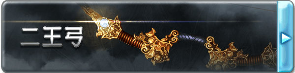

# 二王弓

■二王弓（D+1000）

镇压整个苍天之下的威胁、具有无与伦比天赋的才人-索恩所使用的长弓，散发着凛然的威严是注视着久远的两道光辉，一箭消灭尔今可能发生的灾祸的种子，继续守护着天空的宁静。

作为武器具有5L的武器伤害，【破甲5】的性能，基础射程40米，力量需求2。二王弓无法使用普通的箭矢，当它展开的时候，数支由光组成的箭矢会组成圆形环绕在自身的身周，中间会具现出星云的图案。你可以随时取下这些箭矢用作射击，你每用掉一支箭矢就会身周的光环中便会自动补充一支供你取用。

■［天眸］二王弓·真（C+1000）

灿然发光的宝珠的真意是义烈与救济。无声无息地射出的锐利意志超越了时空，将过去、将来和现在不被允许的人全部射杀，从而改变世界的命运。

作为武器的性能提升，获得了【能量武器】以及【魔眼的狩人】特性。

【魔眼的狩人】

无人可以从二王弓的毁灭之光下逃脱，二王弓所射出的箭矢将会在离开弓身之际，分裂为数道流光，自动攻击武器无减值射程范围内的所有敌对单位。

■［天眸正］二王弓·○（B+2000）

元素的力量寄宿于至纯的灵宝之中，煌煌的宝珠绽放出只属于你的光辉，在其他人的手里二王弓将失去一切效果和能力，变为一把普通的长弓。从以下几个词缀中选择一个作为二王弓的后缀，这将会使二王弓所造成的任意伤害转变为对应的类型。与此同时，二王弓的上端会出现对应属性颜色的庞大流光。

焔:盛燃的红莲之火，挥动便会卷起热浪，在阴天降下火炎之雨，那份激昂能将遥远的天空灼烧，其对应的伤害为灼热。

雪:绝对零度之力，缠绕着将气力剥夺的白色瘴气，能将有形无形之物都转变为水晶的样貌，将永远的寂静强加于没有抗争沉默的连锁的方法的世界，其对应的伤害为冻寒。

界:脉动着的大地之力，大地呼应着歼灭的想法，仿佛有生命一般开始鸣动，依从于它的是世界本身，其对应的伤害为原本的物理伤害。

凪:让空气变得肃然的风平浪静之力，那能让狂乱的暴风也轻易恭顺的姿态，才与君临狂暴天空之巅的人相应，其对应的伤害为音波。

煌:将黑暗照亮的闪光，白色的光华从宝珠中绽放之时，所有的罪恶都将被裁决，没有人能够从看穿真实的裁决之光那里逃离，其对应的伤害为神圣。

煉:吞噬万象的暗之力，闪烁着妖艳光辉的宝珠能将世间万物迷倒，无论是意志强大的生者，抑或是没有意志的死者，所有的一切都将如其想要的那样，其对应的伤害为亵渎。

作为武器的性能再度提升，获得了【8加骰】的特性，并且获得特性【腐败（Depravity）】和【孤高的狙击手】。

【腐败（Depravity）】

受到二王弓伤害的单位会承受各种异常状态，从以下的异常中随机选择一个发动：

弱體耐性down(在承受异常的时候，效果量提升等于伤害数的三分之一，持续一场景)

毒　　　　  (效果量等于胜出数，效果等同流血，但是使用智力+医疗解除)

燃烧　　　　(效果量等于胜出数)

腐敗　　　　(效果量等于胜出数，效果等同流血，但是只能通过自身的强韧解除)

暗闇　　　　(效果量等于胜出数，效果等同炫目，正常豁免)

魅惑　　　　(效果量等于胜出数)

不死　　　　(当受到治疗效果时，该效果转为等同的伤害，持续一次，每3点伤害额外提升一次)

睡眠　　　　(效果量等于胜出数，效果等同纠缠，正常豁免，但是严重状态转为睡眠)

麻痺　　　　(效果量等于胜出数)

攻击down　　(攻击上承受等于成功数的减值，减值取高不叠加，持续一场景)

防御down　　(防御上承受等于成功数的减值，减值取高不叠加，持续一场景)

以上效果均视为异常状态。

【孤高的狙击手】

对于任何受到二王弓伤害或异常的单位，若其身上还保持着对应伤害或者异常，那么其一旦进入持有者的敏感范围就会立刻被定位，这视为一个C级的魔幻本质侦查效果。

■[天眸]二王弓·○○（A+4000）

弓身上出现星彩的琉璃，被选中者射出一矢之时，箭将会绽放出如同夜空中的极星一样的光辉，将整个战场染上鲜艳的彩色。

对应在B级选择的属性，二王弓的后缀将会再次转变，并带来新的效果。

焔→紅天:武器攻击造成的伤害将会带来等于胜出数的【燃烧】，正常豁免。

雪→蒼天:武器攻击造成的伤害将会带来等于胜出数的【冻结】，正常豁免。

界→轟天:武器获得【眩晕】特性，并且威猛提升10点

凪→疾天:武器获得【超级贯穿】特性，并且高速提升10点

煌→白天:武器获得【光明】特性，持有者在死亡后，灵魂会被保护在武器中，若被带回主神空间则可以支付C+1000重塑身体而复活。

煉→黒天:武器获得【黑暗】特性，被该武器击杀的单位将无法以任何方式复活，这是一个S级的诅咒来源效果。

此外二王弓作为长弓的性能达到了极致，武器伤害提升为12L，高速提升至20，获得【超级贯穿】与【神兵】特性。这一阶段的二王弓无法被任何方式破坏。此外二王弓获得了【The Clincher】和【压迫之影】两个特性。

【紧钳一矢（The Clincher）】

当对象受到二王弓造成的伤害时，伤害会得到提升，其数值等同目标身上的异常种类。

【压迫之影】

当以二王弓造成异常状态时，在计算完异常效果之后，持有者可以选择将该异常提升等同豁免后的数值或者6点（取低）。

▓▓二王弓技-二王双極雷洪

若无特殊说明，该技能树下的技艺只能由二王弓为媒介来发动。

■墨丘利的轻盈（Merculight）（C+1000）

◆发动动作:移动

◆使用間隔:5轮

◆効果時間:1轮/3轮

「息を潜めて、研ぎ澄ます…」

发动后的一轮中，对应下一次的涉及自身的攻击，自身可以立刻使用反射动作进行一次距离不大于自身速度的移动。

此外在之后的3轮中，自身的射击的射程提升2倍。

■二王的纷争（C+1000）

◆发动动作:标准

◆使用間隔:10轮

◆効果時間:立即

「東西を瞬く間に横断せし二王の炎、眼前の敵を焼き貫け！」

将目标污秽引燃的不净之炎，以箭矢作为引线。

对目标进行一次射击，造成伤害即可发动，对于目标身上的不良状态，若为原本是一次短休息获得进行豁免机会，一次长休息获得移除机会的，则改为一次长休息才能获得豁免机会，24小时的修养才能获得移除机会；若原本为持续一个场景，则改为持续至下一次短休息；若是以时间计数，则持续时间提升90秒。这是一个C级的诅咒来源效果。

■深度腐败（Deep Depravity）（B+2000）

◆发动动作:移动

◆使用間隔:2轮

◆効果時間:1轮

「追い詰めるわ」

该能力可以至多5次重复购买，且只能在二王弓提升至B级后购买。

持续期间内，自身的攻击获得【腐败深度2X】（X为购买该能力的次数），每当【腐败（Depravity）】被触发时，目标会额外再获得等同【腐败深度】个各不相同的随机异常。

■星体猎手（A+4000）

◆发动动作:标准

◆使用間隔:一场景内再使用不可

◆効果時間:特殊

「この眼で捉えた！　射抜いてみせる、アストラルハウザー！」

射出如同星光般极速的箭矢，被命中的敌人将陷入无尽的麻痹地狱。

对目标进行一次射击，本次射击视为接触攻击，并且高速提升20。结算完伤害之后目标须进行一次DC等于伤害数的+12的强韧检定，若失败则会陷入定身状态，此后每次在其行动开始时其会再次获得一次对抗的机会，若成功则摆脱定身状态，反之则再维持一轮。特殊的，在该定身状态下，目标也无法进行需要语言要素的行动。这个状态至多持续180秒，视为一个A级的创伤来源效果。
