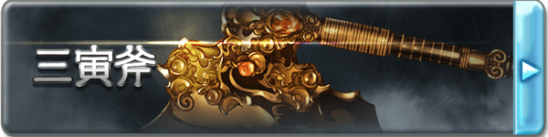

# 三寅斧

■三寅斧（D+500）

镇压整个苍天之下的威胁、信奉弱肉强食法则的无双之兽－萨拉萨所使用的变形斧，位于斧头之上的是构筑基石的三道光辉。象征的体系将混沌镇压，开拓因果，用创造出的斧刃将天地继续开辟。

作为武器具有5L伤害，【威猛5】【沉重】【攻击DP-2】的性能，以及特性【星界剑斧】【怪力乱神】。不是强者是无法驾驭这把巨斧的，持有者只能使用力量作为三寅斧攻击的主属性，且若自身力量低于对应三寅斧等级的上限（D6C11B16A21），则每低1点，在持握三寅斧的时候会受到每轮1点的，不可豁免的严重伤害。

【星界剑斧】

通过一个移动动作，三寅斧可在大剑和巨斧两种形态中转化。剑模式下斧刃向下滑动随后向内收缩，转化为剑的侧刃。

【怪力乱神】

根据三寅斧的状态不同，将赋予持有者“激昂”与“愤怒”两个不同的状态，斧模式对应愤怒，剑模式对应激昂。

愤怒：使用三寅斧进行攻击时会额外获得3个附加成功，但是会失去5点攻击DP。

激昂：使用三寅斧攻击时会失去3个附加成功（若不足则失去全部），每因此失去1个附加成功则会额外获得3点攻击DP。

■［歴礎］三寅斧·真（C+1000）

位于斧头的宝珠的真意是秩序和镇静。永不衰败的光辉，无数次斩除了威胁世界的混乱，以安宁之光指引人们。

作为武器的性能提升，伤害提升至9L，威猛提升至10，体积提升为5，特性【怪力乱神】也得到了提升。

【怪力乱神】

愤怒：使用三寅斧进行攻击时会额外获得6个附加成功，但是会失去9点攻击DP。

激昂：使用三寅斧攻击时会失去5个附加成功（若不足则失去全部），每因此失去1个附加成功则会额外获得4点攻击DP。

■［歴礎絶］三寅斧·○（B+2000）

元素的力量寄宿于至纯的灵宝之中，煌煌的宝珠绽放出只属于你的光辉，在其他人的手里三寅斧将失去一切效果和能力，变为一把普通的斧头。从以下几个词缀中选择一个作为三寅斧的后缀，这将会使三寅斧所造成的任意伤害转变为对应的类型。与此同时，三寅斧的上端会出现对应属性颜色的庞大流光。

焔:盛燃的红莲之火，挥动便会卷起热浪，在阴天降下火炎之雨，那份激昂能将遥远的天空灼烧，其对应的伤害为灼热。

雪:绝对零度之力，缠绕着将气力剥夺的白色瘴气，能将有形无形之物都转变为水晶的样貌，将永远的寂静强加于没有抗争沉默的连锁的方法的世界，其对应的伤害为冻寒。

界:脉动着的大地之力，大地呼应着歼灭的想法，仿佛有生命一般开始鸣动，依从于它的是世界本身，其对应的伤害为原本的物理伤害。

凪:让空气变得肃然的风平浪静之力，那能让狂乱的暴风也轻易恭顺的姿态，才与君临狂暴天空之巅的人相应，其对应的伤害为音波。

煌:将黑暗照亮的闪光，白色的光华从宝珠中绽放之时，所有的罪恶都将被裁决，没有人能够从看穿真实的裁决之光那里逃离，其对应的伤害为神圣。

煉:吞噬万象的暗之力，闪烁着妖艳光辉的宝珠能将世间万物迷倒，无论是意志强大的生者，抑或是没有意志的死者，所有的一切都将如其想要的那样，其对应的伤害为亵渎。

作为武器的性能再度提升，伤害提升为15L，威猛提升为15，获得【眩晕】。特性【怪力乱神】再次得到提升，并且获得特性【暴虎冯河】。

【怪力乱神】

愤怒：使用三寅斧进行攻击时会额外获得9个附加成功，但是会失去12点攻击DP。

激昂：使用三寅斧攻击时会失去6个附加成功（若不足则失去全部），每因此失去1个附加成功则会额外获得5点攻击DP。

【暴虎冯河】

受到三寅斧伤害的单位会获得等同持有者力量附加+1的【X易伤】（X为三寅斧造成的伤害类型），持续直到伤害被回复。这是一个B级的创伤来源效果。

■［天砕］三寅斧·○○（A+4000）

斧刃上出现星彩的琉璃，被选中者挥动之时，斧将会绽放出如同夜空中的极星一样的光辉，将整个战场染上鲜艳的彩色。

对应在B级选择的属性，三寅斧的后缀将会再次转变，并带来新的效果。

焔→紅天:如同红莲一般燃烧的宝珠所认可的，是强力胎动的生命的光辉。将天地万物化为灰烬的无与伦比的劫火让黑烟熏染，指向了通向彼方的天道。武器攻击造成的伤害将会带来等于胜出数的【燃烧】，正常豁免。

雪→蒼天:睿圣漩涡中的宝珠所认可的，是总括真理的贤哲的光辉。寒冷的波涛吞噬了所有堵塞之理，指向了通向彼方的天道。武器攻击造成的伤害将会带来等于胜出数的【冻结】，正常豁免

界→轟天:孕育创世之子的宝珠所认可的，是不可动摇的神气的光辉。将承载天空的大地所掌握的力量，创造出独一无二的回廊，指向了通向彼方的天道。武器获得【眩晕】特性，并且威猛提升10点

凪→疾天:象征着天之情绪的宝珠所认可的，是达到了万理一空的境界的灵魂的光辉。几万时流动的风净化了万物的污秽，指向了通向彼方的天道。武器获得【超级贯穿】特性，并且高速提升10点

煌→白天:散发着圣德天光的宝珠所认可的，是重视缘分的珍贵心灵的光辉。编织的思念绝对不会破碎，被捆绑的缘分指向了通向彼方的天道。武器获得【光明】特性，持有者在死亡后，灵魂会被保护在武器中，若被带回主神空间则可以支付C+1000重塑身体而复活。

煉→黒天:拥有暴食的宝珠所认可的，是抓住一切的无尽渴望的光辉。无限喷出的黑暗平等地消灭善恶，安宁地呼啸，指向了通向彼方的天道。武器获得【黑暗】特性，被该武器击杀的单位将无法以任何方式复活，这是一个S级的诅咒来源效果。

此外三寅斧作为剑斧的性能达到了极致，武器伤害提升为30L，威猛提升至21，体积降低为4，获得【神兵】特性。这一阶段的三寅斧无法被任何方式破坏。此外【怪力乱神】特性再度提升，并且获得了【断筋碎骨】特性。

【断筋碎骨】

三寅斧造成的伤害会对敌人的肢体造成巨大的损伤，会附带等于胜出数的肢体妨害，作用于攻击的部位，正常豁免。

【怪力乱神】

愤怒：使用三寅斧进行攻击时会额外获得15个附加成功，但是会失去20点攻击DP。并且此模式下的攻击可以同时对触及内的所有单位生效。

激昂：使用三寅斧攻击时会失去9个附加成功（若不足则失去全部），每因此失去1个附加成功则会额外获得5点攻击DP。并且此模式下的攻击获得【8加骰】。

▓▓三寅斧技-絶冴羅爪三鉾環

若无特殊说明，该技能树下的技艺只能由三寅斧为媒介来发动。

■枭首之怒（B+2000）

◆发动动作:标准

◆使用間隔:6轮

◆効果時間:1轮

对目标进行一次攻击，根据状态的不同，攻击附带不同的效果。

愤怒：回复等同本次攻击造成伤害的伤害，一次最多回复9L或3A。【医疗点：110】

激昂：包括本次攻击在内，本轮内自身攻击获得9点附加提升。

■愤怒铸就（B+2000）

◆发动动作:标准

◆使用間隔:6轮

◆効果時間:3轮/立即

根据自身所处状态获得以下效果：

愤怒：每轮一次，当自身受到攻击时，若目标在触及范围内，可立刻消耗反射动作对其进行一次反击，本次攻击无视对方的闪避防御，这是一个A级影响心灵的无视防御效果（但是不能附带招式和能量）。持续时间内，可以攻击自身的敌对单位必须攻击自身，这是一个C级的胁迫效果。

激昂：立刻对同一个目标进行两次攻击，这两次攻击造成伤害后，会额外对目标造成等同伤害数值的严重伤害，使用强韧豁免。

■原爆点（B+2000）

◆发动动作:整轮

◆使用間隔:无

◆効果時間:立即

对自身造成8点严重伤害，随后对一个攻击范围内的单位造成等量的不可豁免的严重伤害，随后立刻对目标进行一次攻击。

■三寅的祝福（A+4000）

◆发动动作:整轮

◆使用間隔:一场景内再使用不可

◆効果時間:3轮

效果持续时间内，自身每轮可以额外进行3次普攻，自身的攻击无视盔甲、天生、能量、力场以及偏斜防御，这是A级命运来源的无视防御效果。

（未完待续）

星体迸裂

星体毁灭

起源破灭

流星冲击

湮灭新星

万物归零
