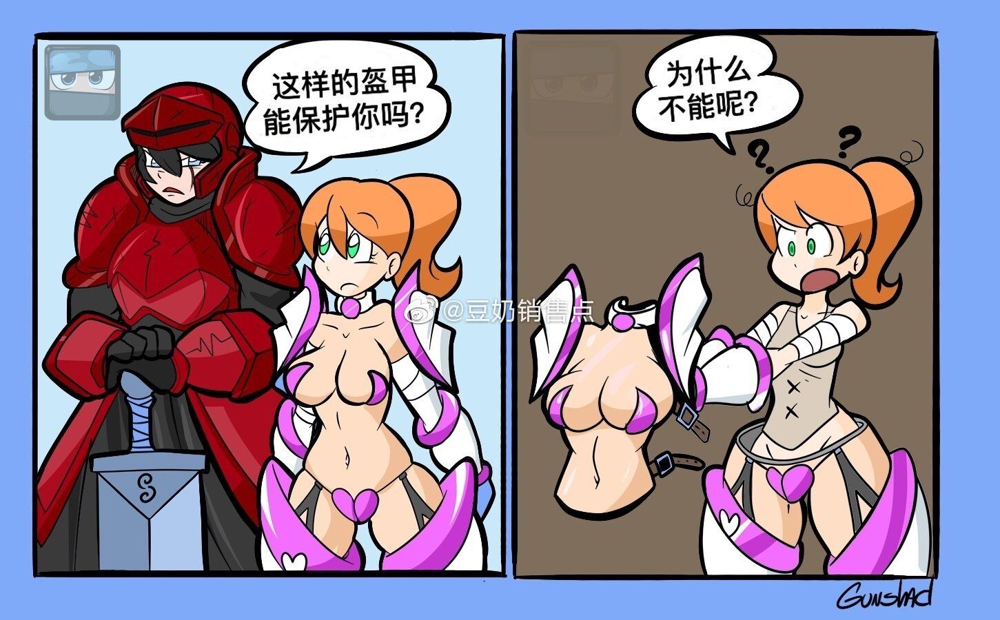

# 比基尼全身甲

（雾）D+1500 特异本质

该盔甲只能由女性穿着。

这是一套覆盖除了头部以下整个身体的全身盔甲，提供8/8盔甲防御，并具有【防弹】【防能量武器】【免疫自然坠落伤害】的特性。因其独特的设计和整体贴合身体以及使用材质较轻的关系，它视为一件轻甲。

以人体肤色作为主体颜色的外壳让穿戴者这种盔甲的使用者像是仅仅穿着单薄的比基尼一样。独特和定制的设计又使其内部完全贴合使用者的身形，同时兼具了防御和触感的材质也具备十分优秀的缓冲效果，可以根据使用者的需求定制盔甲的外形，身材，三围等，但其基础数值必须稍高于使用者。（即，至少是要比本体更胖（雾）丰满一些。）

特殊的，比基尼全身甲无法应用差价升级规则。

视觉预览图（见下图）

