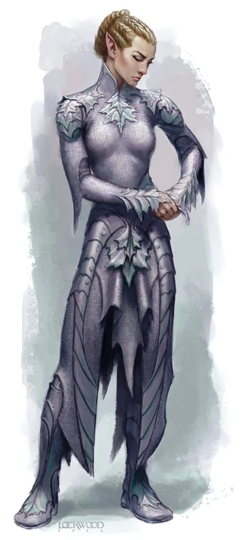

# 精灵链甲

 DD+1000

魔幻本质

这件极其轻便的链甲是由非常精致的秘银环相扣制成。由于精灵的审美关系，这件链甲十分贴身，并在诸如肩部、胸前等要害部位有叶片形状的秘银片在增加防御同时也作为装饰，内衬采用银色的布料保持整体的美观。

基础数据：轻甲（占据上下装），盔甲防御6/6，具有【秘银】特性，并获得2点基于盔甲加值的附加成功。

特殊的，如果精灵链甲的材质被更换，穿戴者将承受-1盔甲减值。

视觉预览图（见下图）

