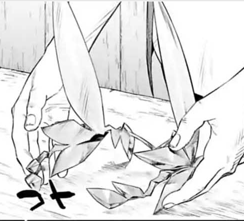

# 遮掩发饰

遮掩发饰 50 魔幻本质

这是一个挂在后脑的金色的发饰，外表像金属制成，但质量较轻。发饰的装饰就像一片片金色的叶片一般（详见配图）。

这个发饰上被附加了可以避开视线的附魔。

效果：

佩戴该发饰后，如果你的相貌值大于2，则在他人眼中你的相貌值只有2点。并且你所具有的态度提升的效果、在社交相关检定的加成等类似效果不会生效。

但如果你进行一些引人注目的行动，发饰的效果将在本场景内不生效。例如：主动对他人进行魅惑、提醒他人注意自己的相貌、进行某些会吸引大众的目光的行动。
