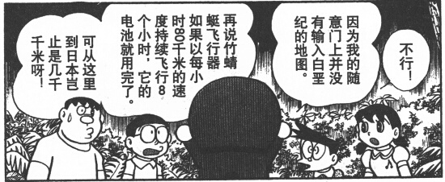

# 多啦A梦系列道具

如无特殊说明均为特异本质

竹蜻蜓

介绍

    哆啦a梦中的神奇道具，它可通过意念控制飞行，其飞行原理为产生反重力场。

    它的自身的电力，足够以80公里的时速连续在空中飞行8小时。

价格：D+1500

效果：

    竹蜻蜓被视为一种轻载具，它的结构值为10点，受到攻击时，竹蜻蜓视为拥有5点闪避防御的载具。

    此道具的飞行机动性为完美，基础飞行速度为66米；其使用方法是将其放在头顶上，随后用意念启动控制。

    竹蜻蜓内置一枚无限能量的标准能量池，不过它在连续飞行八小时后会暂时耗尽电力，需要等待20小时充能时间。

记忆面包 1分每片

将这种面包放到任何平面媒体上，其上的文字，图像等就会印到面包上，吃掉面包你就能立刻完整记住被印上去的内容（你不一定能理解这些内容）。这效果持续24小时。之后，你就会在厕所里将所有这些内容排泄出去，所有记得的内容都会被忘掉，如同你没吃过面包。一个人的肚子是有限的，一个普通人一顿饭最多吃掉体积*2片面包，根据人物本身的特性酌情增减（ST决定）。完整印下一张A4纸的信息需要2片面包。

念写画纸 5分/张

只要拿着这张画纸，就能将你所想象的画面在这张纸上浮现出来。按照你所想像的内容，画纸将会以插画或漫画的形式浮现画面（漫画的话可能需要多张画纸）。

每张画纸只能使用一次。

空气枪 200

这是一个金属管，将它套在手指上，喊“砰”就可以发射空气冲击波，效果类似无限弹药大型手枪。但要注意：

首先，空气枪发射的是空气冲击波，这是力场效果。

其次，空气枪只会造成冲击伤害，如果冲击槽满，多余的造成等于(伤害-耐力)的眩晕点数，单次遭遇的眩晕点数累加，但每轮会-1，若眩晕点数超过耐力和决心的较高者则昏迷，直到眩晕点数减至比耐力和决心中较低者还小才会醒来。

第三，只有点射模式。

第四，一只手可以套一个空气枪，但每次喊“砰”只能激发一只手的空气枪，你可以自由选择激发哪一个，不需要动作。

第五，除了套空气枪的手指，其它的手指可以正常使用。

第六，没有空气的地方不能用。

第七，如果别人的手上套有空气枪，你也可以拿着别人的手来用，用法和你套在你自己手上一样。

空气枪液 2000每瓶

涂在手指上就可以有和空气枪一样的效果，但弹药只有10发，一瓶液体可以涂抹100次。

空气炮 3500

一个大号金属管，将它套在手上，喊“砰”就可以发射空气冲击波，效果类似无限弹药机关炮。限制与空气枪相同，除了第五条改成：套了空气炮的手不能做其它事情。

万用水龙头 100

一个水龙头，可以安在任何垂直的表面，装好后，拧开水龙头即可出自来水，自来水属于人工制造。

万用通行证 1200

自购买之日起有一年的期限（主神空间内的时间不算），此间你可以凭此证进入任何需要证件票据等才能进入的场所。这并不能保证你进入时和进入后的各种情况不被监视和记录。此证件对于其它类型的（即票据证件之外的）进入限制无效，比如男性不能凭此证进入女澡堂。

相反面霜 100/剂

擦上一剂面霜后，皮肤上的对温度的感觉都会变的相反。寒冷会变炎热，炎热则会变寒冷。效果持续24小时。

具体而言，你对温度的感觉是以裸露在外的体表温度为准来进行倒置的。即，如果你的体表温度为15度，而事实上的外部温度为20度，那么你涂了面霜会感到的温度为10度。

当你受到火系或寒系伤害，伤害属性也会倒置，这可能导致你受到伤害或抵抗伤害。

动物变身饼干 100分/块

不同动物形状的饼干，例如：猩猩，猫，恐龙等等。吃下动物饼干后，你会在1分钟内变成该动物，但无法控制具体在什么时刻变形，而且如果没有注意这件事情，你自己甚至不会知道自己已经变形了，这个变形效果会维持5分钟。你除了体型体貌变化外，不会获得任何其它好处，并且你会失去语言能力，你说的话会自动转变为你变成的那种动物的原生语言（若能用原生语言表达）或者无意义的叫声（若无法用原生语言表达），但这不能使你听懂动物的语言。

石头帽 A+8000

一顶平平无奇的帽子，带上以后，任何人都会无视你（包括你的队友，善意的NPC等等）。但你做事仍会留下痕迹，发出声音，只是人们注意不到你的存在（有可能从蛛丝马迹推断出你的存在），带上的人可以对所有生物获得全隐蔽效果，不会被任何形式的侦察手段揭示，视为拥有【反侦测等级】S级的物品。

棒球帽 A+10000

带上这顶帽子，你投掷的东西会必然命中目标，或者达到你希望达到的位置（前提是有一条路径可以达到，并且你能明确指出目标位置）。此外，在你进行投掷攻击时，可以忽略目标一切除了盔甲、天生和格挡之外的防御。这些效果都是A级时空来源的效果。

名刀电光丸

本质：特异本质

价格：A+8000

体积：2

分类：刀(日本刀)

武器基本属性：武器伤害10L，8加骰，如果不想要伤害对手也可以选择将武器伤害下降为10B

武器特殊属性：格挡8、眩晕

描述：译作雷达刀（闪光号），是哆啦A梦的秘密道具之一，主要用于近战，理论上来说会接住敌人的任何招式，使用者在剑术对决中必胜

剑术大师：即便是不会使用日本刀的人也可以轻松掌握剑术，使用电光丸战斗时，武技技能视为提升到15并获得15级刀专业。

自动格挡：电光丸会自动格挡来自敌人的任何招式，不需要花费动作就可以自动格挡。

高性能雷达：电光丸会自动索敌发现敌袭并进行战斗，只要你持有电光丸，即便你本人完全没有发现敌人也会为你自动格挡并且展开战斗，这视作一个S级的免疫措手不及的能力。

电光丸使用标准能量电池，一颗电池可以让电光丸战斗10分钟。没有电池的电光丸只是普通的塑料玩具。
